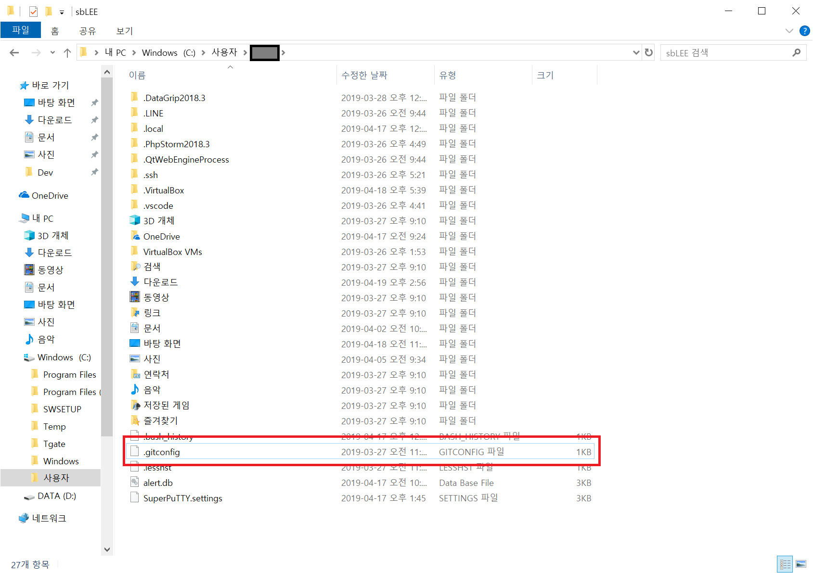

# Git 최초 설정
- `git config`를 이용해서 설정 내용을 확인하고 변경 가능
  1. `/etc/gitconfig` : 시스템의 모든 사용자와 모든 저장소에 적용되는 설정
      - `git config --system` 옵션으로 이 파일을 r/w 가능 (시스템 관리자 권한 요구)
  2. `~/.gitconfig`,`~/.config/git/config` : 현재 사용자에게만 적용되는 설정
      - `git config --global` 옵션으로 이 파일을 r/w 가능 (현재 사용자의 모든 저장소에 적용)
  3. `.git/config` : 깃 디렉토리에 있고 특정(or 현재 작업중인) 저장소에만 적용됨
      - `--local` 옵션으로 이 파일을 r/w 가능 (default로 이 옵션이 적용됨)

- 우선순위
  - (3)`.git/config` > (2)`~/.gitconfig`,`~/.config/git/config` > (1)`/etc/gitconfig`

- Windows `.gitconfig` 위치 : `$HOME` 디렉토리(`C:\Users\$USER`)

  

- Windows `/etc/gitconfig` 위치 : MSys 루트의 상대경로 기준 (보통 숨김폴더 `C:\ProgramData\Git\config`)
- 시스템 설정 파일 경로는 `git config -f <file path>`로 변경 가능 (관리자 권한 필요)

## 사용자 정보
- 깃은 커밋할 때 마다 설정한 사용자 이름, 이메일 정보를 사용
```
git config --global user.name "사용할 이름"
git config --global user.email "사용할 이메일"
```
- `--global` 옵션으로 설정하는 것은 한 번이면 됨 (현재 사용자의 모든 저장소에 적용되므로)
- 프로젝트마다 다른 이름, 이메일 주소를 사용하고자 하면 `--global`옵션을 제거하고 설정

## 설정 확인
- `git config --list` 명령으로 확인 가능
```
$ git config --list
user.name=John Doe
user.email=johndoe@example.com
color.status=auto
color.branch=auto
color.interactive=auto
color.diff=auto
...
```
- 깃은 같은 Key를 여러 설정파일(위의 우선순위에 따른)에서 읽으며 우선순위가 높은 설정 값을 사용

- `git config <key>` 명령으로 해당 값이 현재 어느 값인지 확인 가능
```
$ git config user.name
John Doe
```

## 도움말
```
$ git help <verb>
$ man git-<verb>

$ git <verb> -h, --help
```
***
# Git 저장소 만들기

## 기존 Git 저장소가 아닌 디렉토리를 Git 저장소로 만들기
- 해당 디렉토리에 위치한 상태에서 다음의 명령어 실행
```
$ git init
```
- 이 명령은 `.git` 하위 디렉토리를 생성
- `.git` 디렉토리는 저장소에 필요한 스켈레톤 파일들이 저장됨  
  (아직은 프로젝트에 어떠한 파일도 관리하지 않는 상태)

- 깃이 파일을 관리하게 만들기 위해서는 저장소에 파일을 추가하고 커밋을 해야함
```
git add <some file>
git add LICENSE                   # 해당 프로젝트에 라이센스 추가
git commit -m "<commit msg>"
```
- 위 명령을 통해 깃 저장소가 파일을 관리하게 할 수 있도록 커밋함
- LICENSE로 위 명령어로 추가 가능

## 기존 저장소를 Clone 하기
- 다른 프로젝트에 참여하거나 깃 저장소를 복사하고 싶을 때 사용
- `git clone <url>` 명령을 통해 가능
- 해당 명령을 통해 프로젝트 히스토리를 전부 받아옴
```
$ git clone https://github.com/libgit2/libgit2
```
- 위 명령은 'libgit2' 깃 저장소 디렉토리를 만들고 `.git` 하위 디렉토리를 생성
- 그리고 데이터를 모두 가져와 가장 최신 버전의 브랜치로 체크아웃 해놓음
```
$ git clone https://github.com/libgit2/libgit2 mylibgit
```
- 위 명령을 통해 생성되는 디렉토리의 이름을 변경할 수 있음
- `<url>`에 들어갈 리소스 경로는 HTTPS, `git://`, SSH 프로토콜 사용 가능