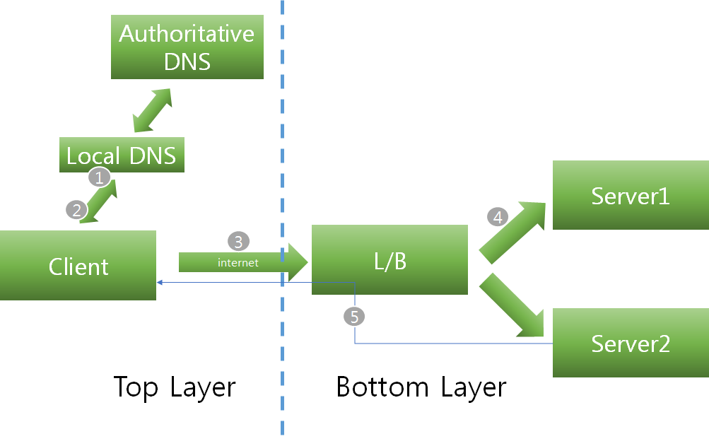
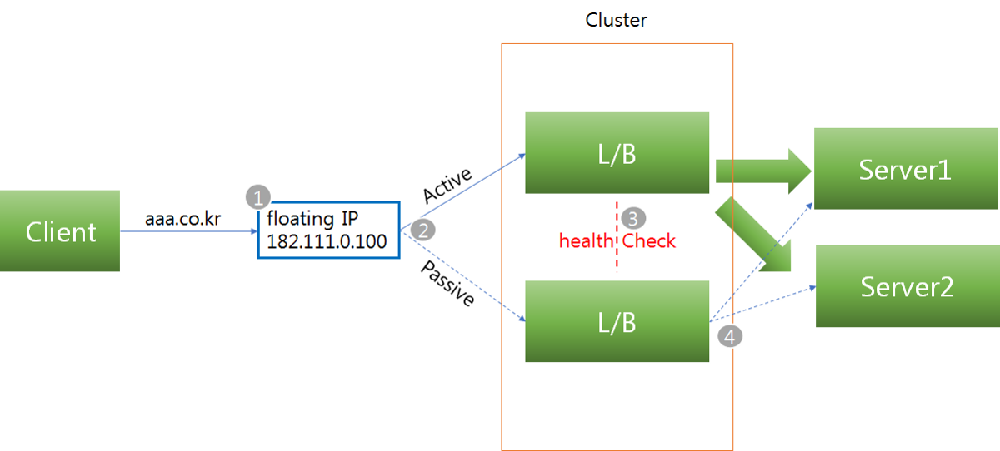
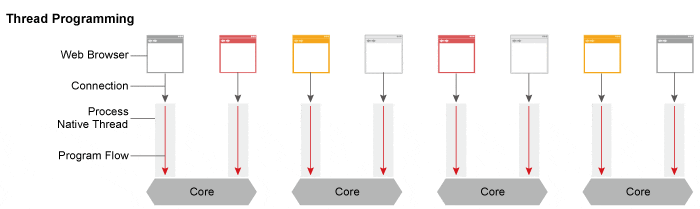
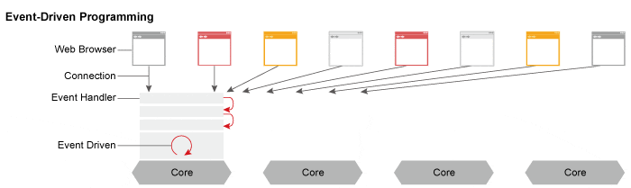
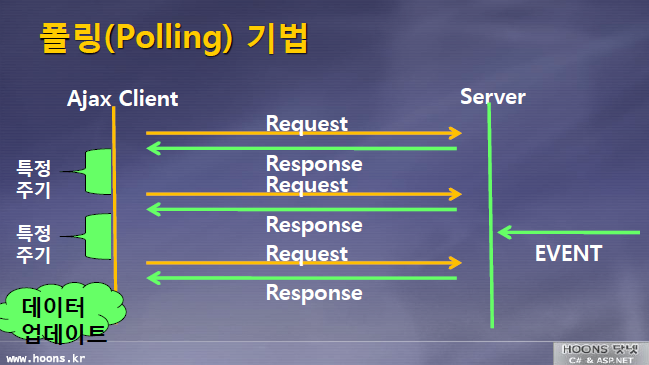
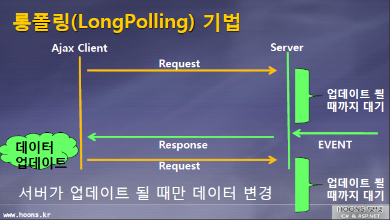

# 부록
# Client - Server Model
- 클라와 서버라는 단어는 물리적 구분보다는 역할 구분에 해당
- 서비스의 구성이 직관적
- 서비스를 변경하기 위해서는 거의 서버만 바꾸면 해결
  
## 중앙 집중 방식
- 다수의 클라와 소수의 서버는 서버의 과부하를 야기
- 과부하는 서버 기계뿐만 아니라 서버 기계에 물린 네트워크에도 등장할 수 있음
  
## Scale-out, Scale-up
- 위의 과부하를 해결하기 위해 서버 기계 증설

- Scale-out
  - 수평 확장성
  - 서버 대수를 추가해서 서비스를 확장하는 것
  - 비슷한 서버가 옆으로 늘어나는 것처럼 보임

- Scale-up
  - 기계 자체의 스펙을 높이는 것
  - 하드웨어의 성능을 높여 서버 성능 향상 효과

- Scale-up보다 Scale-out이 가성비가 훨씬 좋아 선호됨

- 항상 Scale-out이 가능한 건 아님
  - '웹 서버'는 확장성이 좋은 프로그램이기에 수평확장이 쉬운편
  - 하지만 확장성은 디비 서버에 부하를 야기하면서 얻는 것
  - 동적 서비스를 많이 제공할 경우 힘듦

- 떄문에 실시간 컨텐츠가 주인 게임은 직접 서버프로그램 구현(소켓 서버)
  - 소켓 서버 자체는 클라와의 네트워크 연결, 패킷 전송만 담당
  - 클라끼리의 통신, 클라의 서버 간 이동은 별도의 분산처리 구현 필요

- 구현에 들어가는 노력과 scale-up 비용의 trade-off를 고려
  - 일반적으로 scale-out이 가성비가 좋지만 분산 처리 구현의 노력 필요
  - 서버를 여러개로 나누어 단일 서버당 유저 제한을 걸고 해당 서버 자체의 scale-up

참조 
  - https://blog.ifunfactory.com/2018/05/31/기술컬럼-멀티-플레이게임의-서버-형태와-그-특징에/
  - http://www.inven.co.kr/webzine/news/?news=160006
***
# Load Balancing
- 클라이언트가 소수일 경우 서버는 여유롭게 처리 가능
- 클라이언트가 매우 많을 경우 서버가 뻗게됨
- 로드 밸런싱 : Scale-out 방식으로 여러대의 서버에게 트래픽을 분산

## 주요 기능
- NAT(Network Address Translation)
  - 사설 IP 주소를 공인 IP 주소로 바꾸는 데 사용하는 통신망의 주소 변조기

- DSR(Dynamic Source protocol)
  - 로드 밸런서 사용 시 서버에서 클라이언트로 되돌아가는 경우  
    목적지의 주소를 스위치의 IP 주소가 아닌 클라이언트의 IP 주소로 전달해서  
    네트워크 스위치를 거치지 않고 바로 클라이언트를 찾아가는 개념

- Tunneling
  - 인터넷상에서 눈에 보이지 않는 통로를 만들어 통신
  - 데이터를 캡슐화 하고 연결된 상호 간에만 캡슐화된 패킷을 구별해 캡슐화를 해제

[ref: https://nesoy.github.io/articles/2018-06/Load-Balancer]

## 종류
- L2
  - Data Link Layer
  - Mac 주소를 바탕으로 로드밸런싱
  - 장점 : 구조가 간단, 신뢰성이 높다, 가격저렴, 성능이 좋다.
  - 단점 : Broadcast 패킷에 의해 성능저하 발생, 라우팅 등 상위레이어 프로토콜 기반 스위칭 불가
  
- L3
  - Network Layer
  - IP 주소를 바탕으로 로드밸런싱
  - Router, ICMP 프로토콜, IP
  - 장점: Broadcast 트래픽으로 전체 성능 저하 방지, 트레픽체크
  - 단점: 특정 프로토콜을 이용해야 스위칭 가능

- L4
  - Transport Layer
  - TCP, UDP Protocol
  - 장점 : Port기반 스위칭 지원, VIP를 이용하여 여러대를 한대로 묶어 부하분산
  - 주로 Round Robin 방식 사용

- L7
  - Application Layer 단계에서 로드밸런싱
  - HTTP, FTP, SMTP Protocol

## L4 예시

[ref: https://medium.com/@pakss328/로드밸런서란-l4-l7-501fd904cf05]

1. 브라우저에서 aaa.co.kr 이라고 입력  
  PC에 설정된 Local DNS 서버로 DNS Query  
  Local DNS 서버는 aaa.co.kr을 관리하는 DNS서버(Authoritative DNS서버)에 DNS Query, L4의 VIP주소 획득

2. Local DNS는 획득한 VIP 주소를 전송
  
3. 획득한 DNS를 기반으로 L4 VIP로 http 요청

4. L/B장비는 최적의 서비스 서버를 내부 알고리즘(라운드로빈 등)을 통하여 선별, 요청을 전송  
  그 후 서버 작업 결과를 L/B장비 전송

5. 전달받은 http결과를 L/B장비를 통해 Client에 전송함으로 요청 처리를 끝낸다.

## 서버 선택 정책
- Round Robin
  - 요청을 순서대로 각 서버에 균등하게 분배하는 방식
  - 서버 커넥션 수나 응답시간에 상관없이 모든 서버를 동일하게 처리
  - 다른 알고리즘에 비해서 가장 빠르다

- Least Connections
  - 연결 개수가 가장 적은 서버
  - 트래픽으로 인해 세션이 길어지는 경우 권장

- Hashing
  - 사용자의 IP를 Hashing하여 분배하는 방식
  - 사용자는 항상 같은 서버로 연결되는 것을 보장

- Weighted Least Connections(가중치 최소접속방식)
  - 서버에 부여된 Weight 값을 기반으로 Connection 수의 개수와 같이 고려하여 할당

- Fastest Response Time(응답시간방식)
  - 가장 빨리 응답하는 서버에 이용자 요구를 연결하는 방법
  - 응답시간은 각 서버가 패킷 형태의 요구를 송수신하는데 걸리는 시간을 측정한 것

- Adaptive(최소대기방식)
  - Open또는 Pending(계류중인) 커넥션을 적게 가지고 있는 서버로 네트웍 커넥션 방향을 지정
  - Pending 커넥션은 Full TCP Handshake를 완성하지 않은 것으로, 이것은 초당 클라이언트 Thread의 수가 증가할 때 더욱 잘 수행됨

- Fixed, Hashing, Random, URL-based, Cookie 등 여러 알고리즘 존재

## 로드밸런서 동작방식(Mode 별)
- Bridge/Transparent Mode
  - 사용자가 서비스를 요청하면 L4로 전달된 목적지 IP 주소를 real server IP 주소로 변조하고 MAC 주소를 변조해서 목적지를 찾아가는 방식  
  - [요청 전달 시 변조] : 사용자 → L4 → NAT(IP/MAC 주소 변조) → real server  
    - 사용자가 L4를 호출하면 중간에 NAT가 목적지 IP 주소를 real server IP 주소로 변조하고 MAC 주소도 변조한다.

  - [응답 전달 시 변조] : real server → NAT → L4 → 사용자
    - real server에서 L4를 거치면서 출발지(source) IP 주소를 L4 가상 IP 주소로 변조한다.
    - 동일 네트워크 대역이므로 MAC 주소는 변조하지 않는다.

- Router Mode
  - Bridge/Transparent Mode와 유사하지만 출발지(source) MAC 주소도 변조된다.

- One Arm Mode
  - 사용자가 real server에 접근할 때 목적지 IP는 L4 스위치 IP를 바라본다.
  - L4에 도달하면 L4가 클라이언트에게 받은 목적지 IP 주소를 L4 IP 주소에서 real server IP와 real server MAC 주소로 변조한다.
  - 되돌아가는 IP는 L4의 IP pool의 IP 주소로 변조한다.

- DSR (Direct Server Return) Mode
  - 사용자가 real server에 접근할 때 출발지와 목적지의 IP 주소를 변조하지 않고,  
    L4에서 관리하는 real server의 MAC 주소 테이블을 확인해서 MAC 주소만 변조한다.

- 네트워크 주소 변환(NAT, Network Address Translation) 
  - TCP/UDP 포트숫자 와 소스 및 목적지 IP 주소 등 재기록하여 라우터를 통해 네트워크 트래픽을 주고 받는 기술.
  - 여러개의 호스트가 하나의 공인 IP주소(VIP)를 통해 접속이 목적

## 로드밸런서 장애 대비
- 로드밸런서도 장애가 날 수 있으므로 대비 필요

[ref: https://medium.com/@pakss328/로드밸런서란-l4-l7-501fd904cf05]

1. vip로 접속을하고 active된 로드벨런서로 연결
2. 장애가 났을경우 standby중인 로드밸런서로 연결
3. 이중화된 로드밸런서에서 Health Check
4. 장애로 여분 로드밸런서가 동작 할 경우 이를 통해 서버에 접근

- 참고 : https://medium.com/@pakss328/로드밸런서란-l4-l7-501fd904cf05

***
# HTTP 추가 자료

## HTTP 헤더 최대 크기
- HTTP RFC(Request for Comment)에서는 최대 크기 제한을 두지 않ㅇ므
- HTTP 애플리케이션에서 제한하는 경우
  - Apache 2.0, 2.2: 8K
  - nginx: 4K - 8K
  - IIS: varies by version, 8K - 16K
  - Tomcat: varies by version, 8K - 48K

## URL 최대 길이

| 환경      | URL 최대 길이(주소창 기준) |
| :------ | :---------------- |
| IE8     | 2,083자            |
| IE11    | 2,047자            |
| Edge 16 | 2,047자            |
| 안드로이드   | 8,192자            |
| 크롬      | 32,779자           |
| 사파리     | 65,536자 이상        |
| 파이어폭스   | 65,536자 이상        |

***
# Apache와 Nginx의 차이

## Apache
- 쓰레드 / 프로세스 기반 구조로 요청 하나당 쓰레드 하나가 처리하는 구조
- 사용자가 많으면 많은 쓰레드 생성, 메모리 및 CPU 낭비가 심함
- 하나의 쓰레드 : 하나의 클라이언트 라는 구조

[ref: https://m.blog.naver.com/jhc9639/220967352282]

## Nginx
- 비동기 Event-Driven 기반 구조. 
- 다수의 연결을 효과적으로 처리가능. 
- 대부분의 코어 모듈이 Apache보다 적은 리소스로 더 빠르게 동작가능
- 더 작은 쓰레드로 클라이언트의 요청들을 처리가능

[ref: https://m.blog.naver.com/jhc9639/220967352282]

***
# 모바일 게임이 웹 서버를 이용하는 이유
## 여러가지 이유들..
  - 안정적인 인터넷 연결을 가정하기 어렵고
  - 대역폭(bandwidth)도 이상적이지 않고
  - 데이터 사용량 압박도 있고
  - 배터리 사용량 압박도 있고
  - 모바일 특성상 유저 인터렉션도 제한적이고
  - 가끔 글로벌 원 서버에서 요청도 있고 해서..

  - 아예 '항시 연결'과 '빠른 서버 응답'이 필요없게 만드는 경향

## HTTP를 이용하면?
  - 개발 생산성 : HTTP 서버 > TCP 서버
    - 믿을만한 웹 프레임워크
  - Scale-out 수평 확장성
  - 안전성 (무상태 - 크래시 위협 저하 / 리퀘스트들의 독립성)
  - 가용성 (정상 작동이 가능한 정도)
  - 가유지보수성
***
# Polling / Long Polling / Streaming

## 폴링
- 리얼타임 웹을 기한 기법으로 `일정한 주기`를 가지고 서버로 계속 요청을 보내는 방식
  - 정보가 변하지 않으면 리소스 낭비, 오버헤드/트래픽 발생
  - 서버에서 데이터가 오지 않았음에도 추가적으로 여러번 요청이 오는 경우 존재
- 메세지가 전달되는 간격을 정확히 알고 있는 경우에 적합

[ref: http://clearpal7.blogspot.com/2016/06/vs.html]

## 롱 폴링 (comet, reverse ajax)
- 서버 측에서 접속을 위해 열어두는 시간을 좀더 길게 하는 방식
- 서버에서 커넥션을 물고 기다리고 있는 것
- 서버에 정보가 없으면 클라가 요청한 정보가 생길 때 까지 or 지정한 시간동안 커넥션을 열어둠
- 지정 시간이 끝날 경우 클라가 서버로 다시 요청
- 실시간 상호작용하는 유저가 많을 경우 한 명의 동작으로 다른 모두가 동시에 응답을 받음
  - 동시에 다수의 유저에 대한 트랜잭션으로 서버에 부하를 줄 수 있음

[ref: http://clearpal7.blogspot.com/2016/06/vs.html]

## 스트리밍
- 클라가 요청을 보내면 서버는 지속적으로 업데이트 되며 무한히 or 지정한 시간동안 커넥션을 열어둠
- 서버는 메시지를 전달할 준비가 되면 바로 응답을 업데이트 함 (응답 요청을 끝내는 것이 아님)
- 서버는 HTTP 응답을 완료하라는 신호를 보내지 않으므로 연결이 계속 유지됨
- 잦은 스트리밍 시도는 방화벽, 프록시 사용 네트워크 환경에서는 불안정