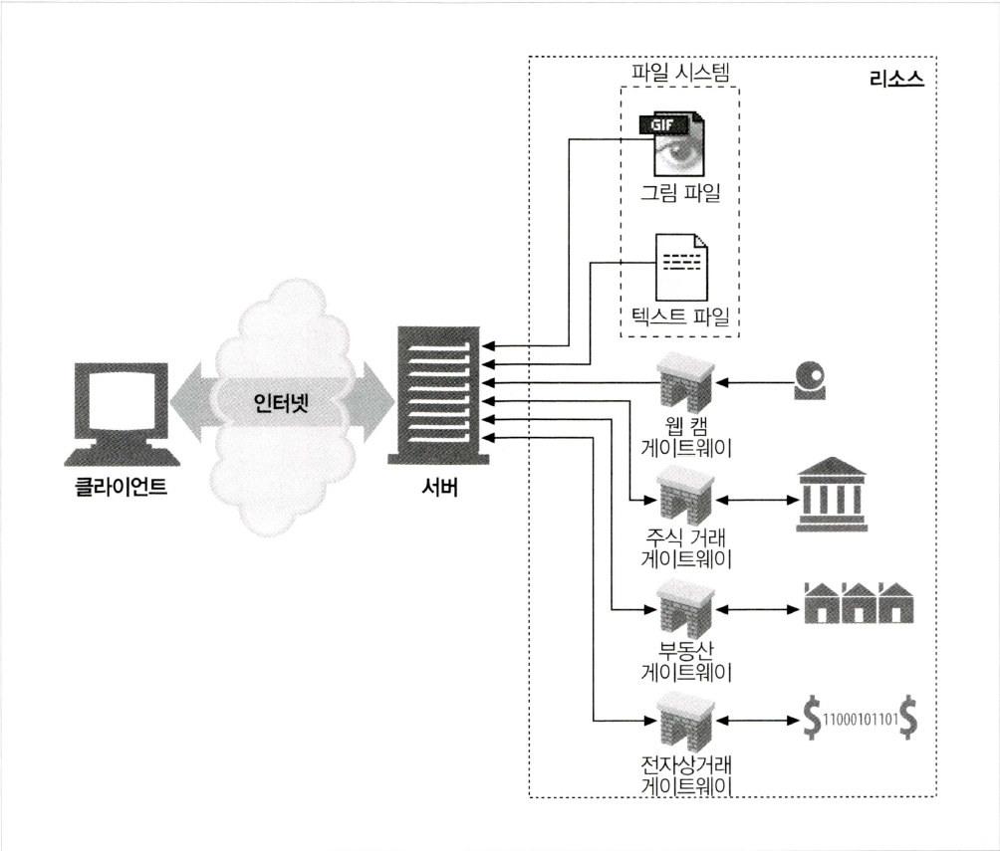
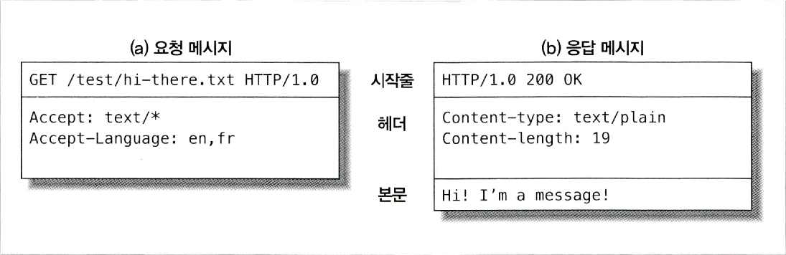

# HTTP 개요

- Tim Berners-Lee : HTTP를 개발한 영국의 컴퓨터 엔지니어로 하이퍼텍스트를 개발했으며, URL, HTTP, HTML을 설계
- HTTP(Hypertext Transfer Protocol)는 인터넷상에서 데이터를 주고 받기 위한 프로토콜
- 신뢰성 있는 데이터 전송 프로토콜(TCP/IP)을 사용하므로 정보의 손실 걱정 없음

***
## 1. 웹 클라이언트와 서버
- 웹 서버(HTTP서버) : HTTP로 의사소통하며 인터넷의 데이터를 저장, HTTP 클라이언트가 요청한 데이터 제공
- 클라이언트-서버(C/S, Client/Server) 모델
  - Client : 사용자 조작에 따라 요청(request)을 전달
  - Server : 해당 요청을 받아 처리 후 응답(response)
  - 복수의 컴퓨터(client, server) 상에서 하나의 모델을 구현한 시스템
  - 대부분의 RDBMS는 C/S 모델을 채택
  - RDBMS의 C/S 모델에서는 사용자 인증 필요
  - 웹서버에서 DB 접속은 CGI(common gateway interface) 프로그램이 담당 (웹서버의 CGI가 DB의 client)  
    ※ CGI : 웹 서버와 외부 프로그램 사이에서 정보를 주고받는 방법이나 규약
  - 예시) HTTP 클라이언트 : 웹 브라우저  
          서버 : Apache, Nginx, IIS, lighttpd
***
## 2. 리소스
- 웹 서버는 웹 리소스를 관리하고 제공
- 정적 리소스 : 요청에 영향받지 않고 항상 정적인 상태인 웹 서버의 파일
- 동적 리소스 : 요청에 따라 컨텐츠를 생산하는 프로그램에 의해 생성되는 결과



  #### 미디어타입
  - HTTP는 전송되는 객체 각각에 MIME(Multipurpose Internet Mail Extensions)타입의 데이터 포맷 라벨을 부여
  - 클라이언트가 서버로부터 돌려받은 객체가 다룰 수 있는지 없는지 확인
  ```
  text/html : HTML
  text/plain : plain ASCII 텍스트
  image/jpeg : JPEG 이미지
  image/gif : GIF 이미지
  ...
  ```
  #### URI(Uniform Resource Identifier)
  - 웹 서버 리소스를 식별할 수 있는 식별자
  - URL, URN 두 종류 존재
  - URL(Uniform Resource Locator)
    - 특정 서버의 한 리소스에 대한 구체적인 위치를 서술
    - 대부분의 URI는 URL로 사용
  - URN(Uniform Resource Name)
    - 리소스의 위치에 영향받지 않는 유일한 이름
***
## 3. 트랜잭션
- 클라이언트와 서버가 리소스를 주고받기 위해 사용하는 HTTP 메세지 통신 단위
#### 메서드
  - HTTP가 사용하는 여러 가지 종류의 요청 명령
  - GET, PUT, DELETE, POST, HEAD 등..
#### 상태 코드
  - HTTP 응답 메세지로 나타나는 응답 상태
  - 200(정상), 302(리다이렉팅), 404(클라이언트오류) 등..
- 애플리케이션은 보통 하나의 작업을 수행하기 위해 여러 HTTP 트랜잭션을 수행
- 웹페이지의 경우 하나의 페이지를 만드는데 여러 리소스가 필요
***
## 4. 메세지
- 웹 클라이언트와 웹 서버가 주고받는 HTTP
```
# 메세지 형태
<시작줄>
<헤더>
<본문>
```



***
## 5. TCP 커넥션
- HTTP는 애플리케이션 계층 프로토콜이므로 TCP/IP 위에서 네트워크 통신이 이루어짐
#### TCP
  - 오류없는 데이터 전송
  - 순서 보장
  - 조각나지 않는 데이터 스트림
#### IP , 포트
  - TCP/IP 커넥션을 맺기위해서는 상대방의 주소를 알아야 함
  - HTTP에서는 URL을 통해 상대방의 IP 주소와 포트를 알아냄
  - HTTP의 표준 포트 : 80
***
## 6. 웹의 구성요소
#### 프록시
  - 클라이언트와 서버 사이에 위치하여 클라이언트의 모든 HTTP요청을 받아 필터링하여 서버로 전달
#### 캐시
  - 클라이언트가 같은 문서를 요청할 경우 캐시를 사용해 더 빠르게 응답
#### 게이트웨이
  - 다른 서버들의 중개자로 작동하는 서버
  - 주로 HTTP 트래픽을 다른 프로토콜로 변환하기 위함
#### 터널
  - 두 커넥션 사이에서 raw데이터를 그대로 전달해주는 HTTP 애플리케이션
#### 에이전트
  - 사용자를 위해 HTTP요청을 만들어주는 클라이언트 프로그램

