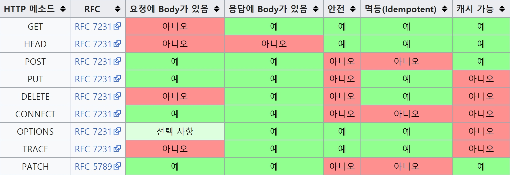

# HTTP 메세지

- HTTP 메세지는 어떤 종류의 데이터이든 전송할 수 있음
***
# 1. 메세지의 흐름
- HTTP 메세지는 HTTP 애플리케이션간 주고받은 데이터의 블록

## 트랜잭션의 인바운드, 아웃바운드
- 인바운드 : HTTP 트랜잭션(요청)이 클라이언트로부터 (원)서버 쪽으로 향하는 방향
- 아웃바운드 : 처리가 끝난 후 응답 메세지가 서버로부터 클라이언트로 되돌아오는 방향
- 다운스트림 : HTTP는 요청, 응답에 관계 없이 다운 스트림으로 흐름 / 메세지의 발송자는 항상 수신자의 업스트림
***
# 2. 메세지의 각 부분
```
# 요청 메세지 포맷
<메소드> <요청 URL> <버전> # (시작줄)
<헤더>

<본문>

# 응답 메세지 포맷
<버전> <상태 코드> <사유 구절>
<헤더>

<엔티티 본문>
```
## 시작줄
- 요청 메세지 : 서버에게 리소스에 대한 처리 명령
- 응답 메세지 : 수행 결과에 대한 상태 정보와 텍스트로된 사유 구절
- 메소드 : 서버에게 무엇을 해야하는지 알려줌

  | 메소드     | 설명                          |
  | :------ | :-------------------------- |
  | GET     | 서버에서 특정 데이터를 가져옴            |
  | HEAD    | 서버에서 특정 문서에 대한 헤더만 가져옴      |
  | POST    | 서버가 처리해야할 데이터를 보냄           |
  | PUT     | 서버의 데이터 전체를 요청 메세지로 저장함     |
  | PATCH   | 서버의 데이터 일부를 요청 메세지로 저장함     |
  | TRACE   | 메세지가 프록시를 거쳐 서버에 도달하는 과정 추적 |
  | OPTIONS | 서버의 수행가능한 메소드 확인            |
  | DELETE  | 서버에서 데이터 제거                 |
  | CONNECT | 프록시를 사용할 경우 터널을 만들기 위한 메서드  |

  - 모든 서버가 위의 메소드를 전부 구현하는 것은 아님

- 각 메서드 특징


[ref: https://javaplant.tistory.com/18]

- 상태코드 : 서버가 클라에게 무슨 일이 일어났는지 알려줌

  | 전체 범위   | 정의된 범위  | 분류    |
  | :------ | :------ | :---- |
  | 100-199 | 101-101 | 정보    |
  | 200-299 | 200-206 | 성공    |
  | 300-399 | 300-305 | 리다이렉션 |
  | 400-499 | 400-415 | 클라 에러 |
  | 500-599 | 500-505 | 서버 에러 |

  - 각 상태 분류마다 정의된 코드는 매우 적지만 맨 앞의 수를 통해 분류 가능
  - 사용자가 자신만의 상태 코드를 정의할 수 있음

- 성공

  | 코드번호 | 설명       | 비고                                               |
  | :--- | :------- | :----------------------------------------------- |
  | 200  | 성공       | 서버가 요청을 제대로 처리했다.                                |
  | 201  | 생성됨      | 요청이 성공했으며, 새로운 리소스를 만들었다.                        |
  | 202  | 허용됨      | 요청을 받았으나, 아직 처리하지는 못했다.                          |
  | 204  | 컨텐츠 없음   | 요청을 처리했지만, 컨텐츠를 제공하지 않는다.                        |
  | 205  | 컨텐츠 재 설정 | 요청을 처리했지만, 컨텐츠를 표시하지 않는다. 그리고 문서를 재 설정할 것을 요구한다. |
  | 206  | 일부 성공    | 요청의 일부만 성공적으로 처리                                 |

- 리다이렉션

  | 코드번호 | 설명       | 비고                                                 |
  | :--- | :------- | :------------------------------------------------- |
  | 300  | 여러 선택 항목 |                                                    |
  | 301  | 영구이동     | 요청한 페이지가 다른 위치로 영구이동 했다.                           |
  | 302  | 임시이동     | 요청한 페이지가 다른 위치로 임시이동 했다. 요청자는 여전히 현재 페이지를 요청해야 한다. |
  | 303  | 기타위치 보기  | 요청자가 다른 위치에 별도의 GET 요청을 하여 응답을 검색할 경우              |
  | 304  | 수정되지 않음  | 마지막 요청 이후 요청한 페이지가 수정되지 않았다.                       |
  | 305  | 프록시 사용   | 요청자는 프록시를 사용하여 요청한 페이지만 접근할 수 있다.                  |
  
  - 304 : `if-Modified-Sine` 헤더에 지정된 날짜/시간 이래로 지정된 문서가 변경된 사실이 없는 경우 이 code로 응답

- 요청 오류

  | 코드번호 | 설명         | 비고                                                  |
  | ---- | ---------- | --------------------------------------------------- |
  | 400  | 잘못된 요청     | 주로 헤더 포멧이 HTTP 규약에 맞지 않을 경우                         |
  | 401  | 권한 없음      | 인증을 필요로 하는 요청이다. Basic access authentication에 사용한다. |
  | 403  | 금지         | 서버가 요청을 거부하고 있다.                                    |
  | 404  | 찾을 수 없음    | 요청한 자원이 서버에 존재하지 않는다.                               |
  | 405  | 허용하지 않는 방법 | 요청에 지정한 방법을 사용할 수 없다.                               |
  | 406  | 허용되지 않음    | 요청한 페이지를 콘텐츠 특성 때문에 응답할 수 없다.                       |
  | 408  | 요청시간 초과    | 서버의 요청대기가 시간을 초과                                    |
  | 410  | 사라짐        | 요청한 자원이 삭제되었음.                                      |
  | 411  | 길이필요       | 유효한 컨텐츠 길이를 명시해야 한다.                                |

  - 410 : 404와 비슷하지만, 과거에 있었으나 지금 없는 자원. (게시판에서 삭제한 포스트에 접근하는 경우)

- 사유 구절 : 상태 코드에 대한 정보를 사용자가 읽기 쉽게 글로 풀어 표시
- 버전 번호 : HTTP/X.Y 형식으로 표기하며 요청과 응답 양쪽에 모두 기술
  - 특정 애플리케이션이 지원하는 가장 높은 버전을 나타냄
  - 응답 메세지의 경우 응답을 보낸 애플리케이션의 HTTP 버전중 가장 높은 것을 나타냄  
    (해당 메세지의 HTTP 버전이 아님)

## 헤더
  - 시작줄 다음에 오는 것으로 메세지에 추가 정보를 더함
  - 각 HTTP헤더는 `KEY: VALUE` 형태로 나타남
  - 참고 : https://gmlwjd9405.github.io/2019/01/28/http-header-types.html

## 엔티티 본문 
  - HTTP가 전달하는 실제 데이터