# 커넥션 관리
# 1. TCP 커넥션
- HTTP 통신은 TCP/IP를 통해 이루어짐
- 일단 커넥션이 맺어지면 클라-서버 간에 주고받는 메세지들은 손실, 순서 바뀜 등의 문제에서 자유로움

<center>
  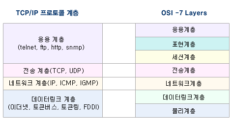
  [ref : http://www.hoons.net/board/cshaptip/content/35343]
</center>

## 신뢰가능한 TCP
- HTTP 커넥션은 몇몇 규칙을 제외하면 TCP 커넥션에 불과
- TCP는 정보의 손실이 일어나지 않음
- 데이터의 순서도 보내는 순서 그대로임을 보장

## TCP 세그먼트
- TCP는 IP 패킷(데이터그램)이라고 불리는 작은 조각을 통해 데이터 전송
  - 메세지 데이터 스트림을 세그먼트 단위로 잘게 나눔
  - 세그먼트들을 IP 패킷(세그먼트에 여러 헤더들을 추가)으로 만들어 전달
  - TCP/IP가 처리하므로 HTTP사용자에게는 보이지 않음

- IP 패킷

| 분류          | 설명                                         |
| :---------- | :----------------------------------------- |
| IP 패킷 헤더    | 발신지, 목적지 IP주소, 크기, 기타 플래그                  |
| TCP 세그먼트 헤더 | TCP 포트 번호, TCP 제어 플래그, 데이터의 순서 번호, 무결성 체크섬 |
| TCP 데이터 조각  | 실제 보내려는 데이터 스트림                            |

<center>
  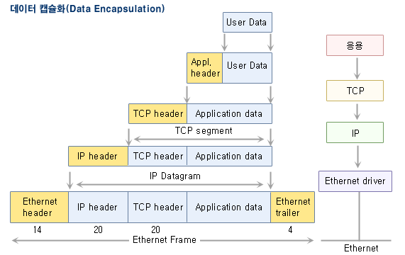
  [ref : http://www.hoons.net/board/cshaptip/content/35343]
</center>

## 커넥션 유지
- PC는 항상 여러개의 TCP 커넥션을 유지
- TCP는 포트번호를 통해 여러개의 커넥션을 유지
- IP주소가 PC로 연결되고 포트번호로 해당 애플리케이션으로 연결
***
# 2. TCP 소켓
- OS별로 TCP 커넥션의 생성과 관련된 여러 기능 제공 (소켓 API)
- 소켓을 이용하면 TCP 종단 데이터 구조를 생성하고 원격 서버에 연결하여 데이터 스트림을 읽고 쓸 수 있음
- 응용 프로그램에서 TCP/IP를 이용하는 창구 역할을 하며 응용 프로그램과 소켓 사이의 인터페이스를 소켓 인터페이스라고 함

<center>
  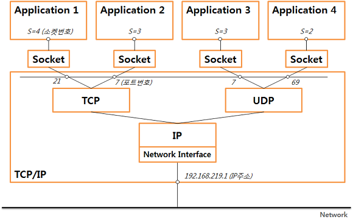
  [ref : https://ddooooki.tistory.com/21]
</center>

  #### 소켓 번호 (socket descriptor)
  - UNIX에서 파일을 열면 `file descriptor`가 생기듯이 소켓도 `socket descriptor`가 생성됨
  - 소켓 기술자는 파일 기술자와 동일한 `descriptor table`로 관리됨
  - 파일 기술자, 소켓 기술자 서로서로 중복되는 것이 없게 생성됨
  - 소켓을 통해 통신할 때 이 소켓 기술자를 사용하여 정보를 얻음

  #### 소켓 이용
  - 상대방과 IP 패킷을 주고받기 위하여는 다섯 가지 정보 필요
    1. 통신에 사용될 프로토콜
    2. 자신의 IP
    3. 자신의 port
    4. 상대의 IP
    5. 상대의 port
  
  #### 소켓 프로그래밍
  - 서버
    - 서버는 socket()을 호출하여 통신에 사용할 소켓을 하나 개설
    - 이때 리턴된 소켓번호와 자신의 소켓주소를 bind()를 호출하여 서로 묶음  
    **※ 서버에서 bind()가 필요한 이유는 소켓번호는 응용 프로그램이 알고 있는 통신 창구 번호이고,  
      소켓주소는 네트웍 시스템(TCP/IP)이 알고 있는 주소이므로 이들의 관계를 묶어 두어야(bind)  
      응용 프로세스와 네트웍 시스템간의 패킷 전달이 가능하기 때문**
    - 서버는 listen()을 호출하여 클라이언트로부터의 연결요청을 기다리는 수동 대기모드로 진입
    - 클라이언트로부터의 연결요청이 왔을 때 이를 처리하기 위하여 accept()를 호출
    - 서버는 accept() 시스템 콜에서 기다리고 있다가 클라이언트가 connect()를 호출하여 접속요구를 해오면 이를 처리

  - 클라이언트
    - socket()을 호출하여 소켓을 만든 후 bind()를 부를 필요 없이, 서버에게 연결요청을 보내기 위하여 connect()를 호출
    - 접속할 상대방 서버의 소켓주소 구조체를 만들어 connect()의 함수 인자로 전달  
    **※ 서버 프로그램과 달리 자신이 사용하는 IP 주소나 포트번호를 다른 클라이언트 또는 서버가  
    미리 알고 있을 필요가 없기 때문에 bind()를 호출할 필요가 없음**  

<center>
  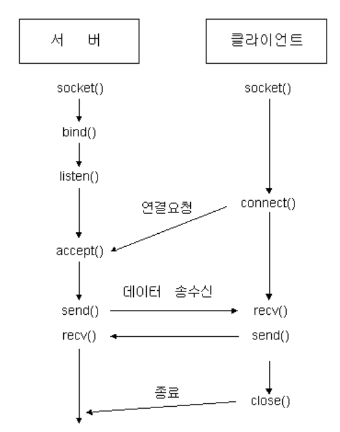
  [ref : http://jkkang.net/unix/netprg/chap2/net2_1.html]
</center>

***
# 3. TCP 성능 문제
- HTTP는 TCP 계층 위에있기 때문에 TCP 성능에 영향을 받음

  #### HTTP 트랜잭션 지연
  - DNS lookup : 클라는 URI에서 서버의 IP, port를 알아야함 DNS resolution 필요
  - Connect : 클라는 TCP connet 요청을 서버로 보내고 허가 응답을 기다림, 새 TCP 커넥션 마다 발생
  - Request : 커넥션이 맺어지면 클라는 HTTP 요청을 TCP 파이프(socket)를 통해 전송
  - Process : 서버는 데이터 도착 시 TCP 커넥션에서 요청 메세지를 읽고 처리
  - Response : 서버가 다시 같은 방식으로 HTTP 응답
<center>
  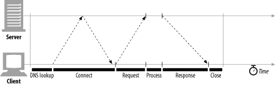
</center>

## TCP 커넥션 핸드셰이크 지연
- TCP 커넥션을 열 때마다 커넥션을 위한 조건을 맞추기 위해 IP패킷을 교환
- 작은 크기의 데이터 전송시 이런 패킷 교환은 성능 저하 요인중 하나
- 3-Way-Handshake 연결 성립
  - 클라는 서버에 접속을 요청하는 SYN(a) 패킷을 보냄
  - 서버는 SYN(a)요청을 받고 클라에게 요청 수락 ACK(a+1), SYN(b) 패킷을 보냄
  - 클라는 ACK(a+1)와 SYN(b)를 받고 다시 서버에게 ACK(b+1)를 보내며 연결이 성립됨

<center>
  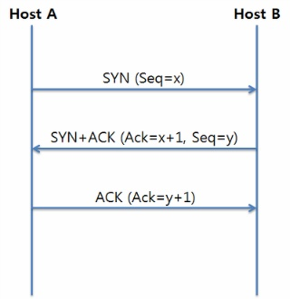
  [ref : https://ddooooki.tistory.com/21]
</center>


- 4-Way-Handshake 연결 해제
  - 클라가 연결 종료한다는 FIN 플래그 전송
  - 서버는 FIN요청을 받고 응답으로 ACK 전송
  - 진행중인 데이터 전송이 있을 경우 데이터 전송이 끝날 때 까지 잠시동안 TIME_OUT
  - 데이터 전송 완료시 클라에게 FIN 플래그 전송
  - 클라는 서버에게 ACK 전송
  - 서버는 클라의 ACK 메세지를 받으면 연결을 CLOSE
  - 클라는 아직 서버로부터 받지 못한 데이터가 있는 경우를 대비해 일정 시간동안 세션을 남겨두고 기다림 TIME_WAIT
  - 한 쪽이 데이터 전송을 마쳤다고 해도 다른 쪽이 보낼 데이터가 남아있을 수 있기 때문에 4단계

<center>
  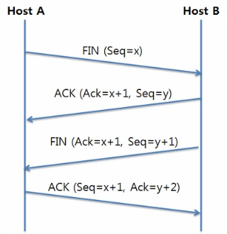
  [ref : https://ddooooki.tistory.com/21]
</center>

- SYN 패킷 전송 당시 랜덤한 난수로 설정
  - 커넥션을 맺을 때 사용하는 port는 유한하며 시간이 지남에 따라 재사용됨
  - 따라서 통신 애플리케이션이 과거에 사용된 포트 번호 쌍을 사용하는 가능성 존재
  - 난수가 아닌 순차적인 번호를 사용한다면 이전의 커넥션에서 오는 패킷으로 착각할 가능성 존재

- HTTP 트랜잭션에서 이 Handshake가 지연을 발생시킴
- TCP의 ACK 패킷은 HTTP 요청 메시지 전체를 전달할 수 있을만큼 큰 경우도 존재
<center>
  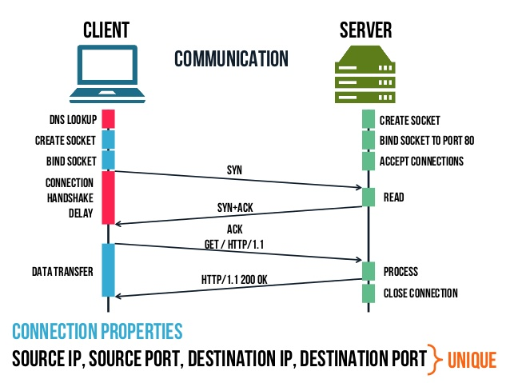
  [ref : https://sysinfo.io/disable-ssl-3-0-windows-server/http-29-638/]
</center>

## 확인 응답 지연
- 수신자가 TCP 세그먼트를 받으면 송신자에게 작은 확인응답 패킷을 반환
- 송신자는 이 패킷을 받지 못하면 패킷 전달에 문제가 생겼다고 판단 후 다시 보냄
- 확인 응답 패킷은 크기가 작기 때문에 같은 방향으로 송출되는 패킷에 편승시킴
- 편승 되는 경우를 늘리기 위해 '확인 응답 지연' 알고리즘을 사용
  - 송출할 확인 응답 패킷을 특정 시간동안 버퍼에 담아두고 편승 시키기 위한 송출 패킷을 찾아 편승시킴
  - 만약 알맞은 송출 패킷을 찾지 못한 경우 별도의 패킷을 만들어 보냄
- HTTP는 요청, 응답 두 가지 형식으로만 이루어지므로 편승 기회가 적음

## TCP slow start
- TCP 데이터 전송 속도는 커넥션이 만들어진 시간에 따라 달라짐
- 커넥션은 시간이 지나면서 튜닝되는데, 처음에는 속도를 제한하고 있다가 데이터 전송이 성공함에 따라 제한을 높여나감
- 패킷이 성공적으로 전달되면 TCP 커넥션은 한 번에 전송할 수 있는 패킷 제한이 2개 늘어남
- 인터넷의 급작스러운 부하와 혼란을 막기 위함

## 네이글(Nagle) 알고리즘과 TCP_NODELAY
- 네트워크의 효율성을 높이기 위해패킷을 전송하기 전 많은 양의 TCP 데이터를 한개의 덩어리로 합침
- 세그먼트가 최대크기가 되지 않으면 전송을 하지 않음
- 다른 모든 패킷이 확인응답을 받았을 경우에는 최대 크기보다 작은 패킷의 전송을 허락
- 다른 패킷들이 아직 전송중이면 데이터는 버퍼에 저장됨
- 전송되고 나서 확인응답을 기다리던 패킷이 확인응답을 받았거나 전송하기 충분할 만큼의 패킷이 쌓일 경우 버퍼의 데이터가 전송됨
- 단점
  - 크기가 작은 HTTP 메세지는 패킷을 채우지 못하기 때문에 추가적인 데이터를 기다리며 지연됨
  - 확인응답 지연과 함께 쓰일 경우 네이글 알고리즘은 확인응답을 기다리고 확인응답 지연 알고리즘은 확인응답 지연시킴
- HTTP 애플리케이션은 성능 향상을 위해 HTTP 스택에 TCP_NODELAY 인자 값을 설정하여 네이글 알고리즘을 비활성화 함

## TIME_WAIT 누적, 포트 고갈
- 이는 성능 측정시에 문제가 될 수 있음
- TCP 커넥션의 종단(end-point)에서 연결을 끊을 경우 해당 종단에서는 커넥션의 IP주소와 port를 기록해놓음
- 같은 주소와 포트번호를 사용하는 커넥션이 일정 시간동안에는 생성되지 않게 하기 위함 (보통 세그먼트 최대 생명주기의 2배)
- 성능 측정시 문제가 되는 부분
  - 테스트 할 클라 PC가 적기 떄문에 생성되는 커넥션의 경우의 수가 작음
  - <클라 IP, 클라 포트, 서버 IP, 서버 포트> 중 클라 포트를 제외한 세개가 고정이기 떄문
  - 클라가 서버에 접속할 때마다 중복되지 않는 커넥션을 생성해야 하므로 포트를 바꿔가며 테스트를 실시
  - 서버가 TIME_WAIT 동안 커넥션 생성을 제한하며 유한개의 포트 개수만큼밖에 테스트를 할 수 밖에 없음
***
# 4. HTTP 커넥션 관리

## 커넥션 헤더
- HTTP는 클라-서버 사이에 프록시, 캐시서버 등 중개서버를 허락함
- 그 중 인접한 HTTP 애플리케이션의 커넥션에서만 적용해야할 옵션을 지정할 때 사용
  - HTTP Connection 헤더 필드는 다른 커넥션에 전달되지 않는 헤더들을 의미
  - 임시적인 토큰 값은 커넥션에 대한 비 표준 옵션
  - close 값은 커넥션이 작업이 완료되면 종료되어야 함을 의미
```
HTTP/1.1 200 OK
Connection: meter, close, x-access-token
Meter: max-uses=3, max-refused=6, dont-report
...
```
- 위 HTTP 메세지에서는 `Meter`헤더를 다른 커넥션으로 전달하면 안되고, 해당 트랜잭션이 끝나면 종료될 것(`close`)을 의미함

## 순차적인 트랜잭션 처리에 의한 지연
- 큰 작업 하나를 처리하는데에 HTTP 트랜잭션이 여러개가 필요한 경우 존재
- 이때, HTTP 트랜잭션이 순차적으로 처리되면(커넥션을 순차적으로 맺음) 커넥션 생성 지연을 고스란히 겪어야함

<center>
  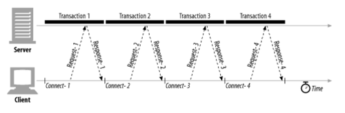
</center>

## 병렬 커넥션
- 순차적인 트랜잭션 처리와는 반대로 트랜잭션을 병렬로 처리
<center>
  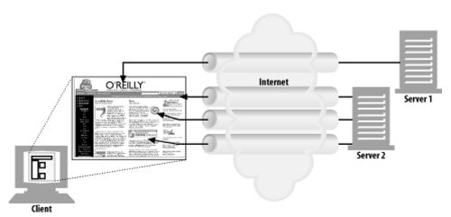
  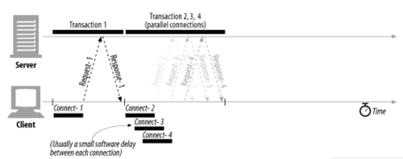
</center>

- 단일 커넥션일때의 대역폭 제한과 커넥션의 대기 시간을 효과적으로 사용
- 하지만 대역폭 제한이 심하거나 커넥션을 여러개 맺을 메모리 역량이 부족한 경우 성능상 이점 없을 수도..
- 또한 서버는 여러 클라 요청을 함께 처리해야 하므로 부하가 큼
- 병렬 커넥션의 단점
  - 각 트랜잭션마다 새로운 커넥션을 맺고 끊기 때문에 시간과 대역폭 소모
  - 각 커넥션은 TCP slow start 때문에 느림
  - 실제로 연결 가능한 병렬 커넥션의 개수는 제한됨 (브라우저는 보통 4개)

## 지속 커넥션
- 같은 서버로 여러 개의 커넥션을 맺을 경우(locality가 높은 경우) 매 트랜잭션마다 커넥션을 새로 맺을 필요가 없음
- HTTP/1.1을 지원하는 기기는 처리가 완료된 후에도 TCP 커넥션을 유지하여 HTTP 요청에 재사용함
- 장점
  - 커넥션을 맺기 위한 작업을 줄여줌
  - TCP slow start 문제 해결
  - 커넥션의 수를 줄여줌
- 지속 커넥션을 잘못 관리하여 많은 커넥션이 유지된 상태로 남을 경우 자원의 불필요한 소모가 나타남
- HTTP/1.0+ : keep-alive, HTTP/1.1 : 지속 커넥션(Connection: close)

<center>
  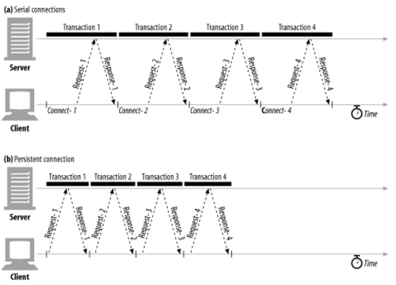
</center>

## 파이프라인 커넥션
- HTTP/1.1은 지속 커넥션을 통해 요청을 파이프라이닝할 수 있음
- 요청이 서버에 전달되면 바로 다음 요청을 보냄으로써 응답 대기시간을 줄일 수 있음

<center>
  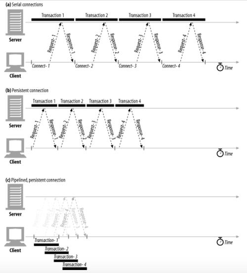
</center>

- 제약 사항
  - HTTP가 지속 커넥션일때만 사용가능
  - 각 요청의 응답 순서는 요청 순서와 같게 나와야함
  - 커넥션이 언제 끊어져도 파이프라인에 있던 요청들은 다시 처리될 수 있어야 함
  - POST요청같은 nonidempotent 요청은 파이프라이닝해서는 안됨