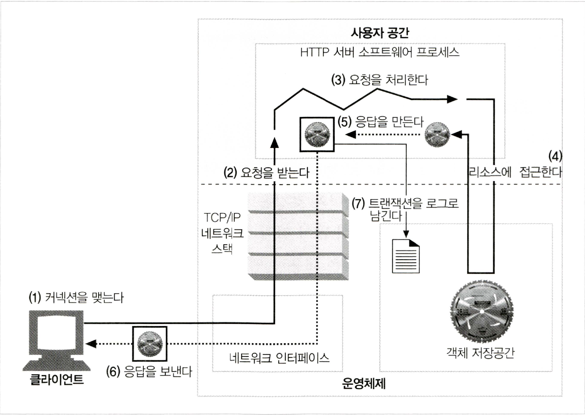
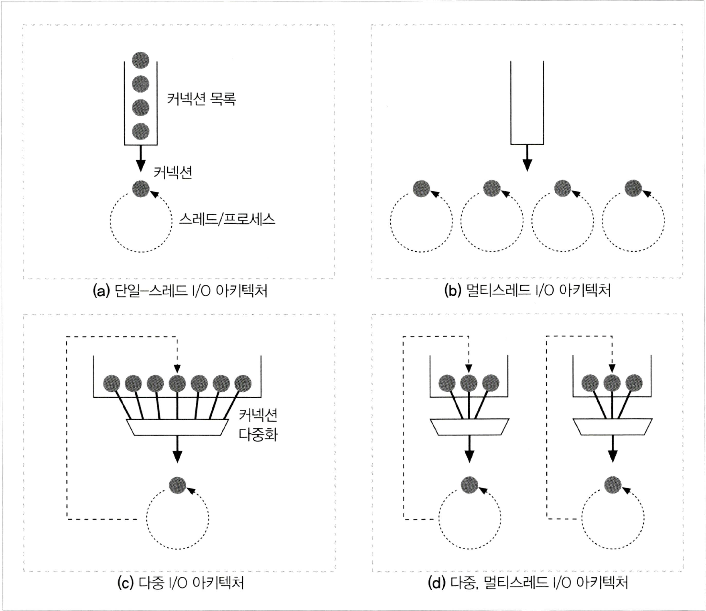

# 웹서버

- 웹 서버는 다음과 같은 일들을 수행
  1. 커넥션을 맺음 - 클라의 접속을 받아들이거나 원치 않는 클라라면 닫음
  2. 요청을 받음 - HTTP요청 메세지를 네트워크로부터 읽어들임
  3. 요청을 처리 - 요청 메세지를 해석하고 행동을 취함
  4. 리소스에 접근 - 메세지에서 지정한 리소스에 접근한다
  5. 응답을 만듦 - 올바른 헤더를 포함한 HTTP응답 메세지 생성
  6. 응답을 보냄 - 응답을 클라에게 돌려줌
  7. 트랜잭션을 로그로 남김 - 로그파일에 트랜잭션 완료에 대한 기록을 남김


[ref: http://blog.choibom.com/book/2018/01/21/HTTP완벽가이드/]

***
# 1. 클라이언트 커넥션 수락
- 클라가 이미 서버에 대해 열려있는 지속적 커넥션을 갖고 있다면  
  요청을 보내기 위해 해당 커넥션을 이용 가능
- 그렇지 않다면 클라는 서버에 대한 새 커넥션을 열 필요가 있음
  
## 새 커넥션 다루기
- 클라가 웹 서버에 TCP 커넥션을 요청하면 웹 서버는 해당 커넥션을 맺고  
  TCP 커넥션에서 IP정보를 추출하여 클라를 인식함
- 커넥션을 맺은 후 서버는 새 커넥션을 목록에 추가하고 데이터를 받을 준비를 함  
  **※ 서버는 어떤 커넥션이든 마음대로 거절하거나 즉시 닫을 수 있음**

## 클라 호스트 명 식별
- 대부분의 웹 서버는 역방향DNS를 사용해서 클라의 IP주소를 클라의 호스트 명으로 변환함
- 서버의 구체적인 접근 제어와 로깅을 위해 사용
- 호스트명 룩업(hostname lookup)은 시간이 걸리는 작업이므로 트랜잭션을 느리게 할 가능성 존재
- 고로 호스트명 분석을 꺼두거나 특정 컨텐츠에만 켜두기를 권장
***
# 2. 요청 메세지 수신
- 커넥션에 데이터가 전달되면 웹 서버는 네트워크 커넥션에서 해당 데이터를 읽어들여 파싱하고 요청 메세지를 구성

## 메세지의 내부 표현
- 몇몇 웹 서버는 요청 메세지를 쉽게 다룰 수 있도록 내부의 자료구조에 저장함

## 커넥션 입력/출력 처리 아키텍쳐
1. 단일 스레드 웹 서버
     - 웹 서버는 한 번에 하나씩 요청을 처리
     
2. 멀티프로세스와 멀티스레드 웹 서버
     - 여러 요청을 동시에 처리하기 위해 여러 개의 프로세스 혹은 고효율 스레드를 할당

3. 다중 I/O서버
     - 대량의 커넥션을 지원하기 위해 대두
     - 모든 커넥션은 동시에 활동을 감시당함
     - 커넥션의 상태가 바뀌면(데이터를 사용할 수 있게 되거나 에러 발생) 해당 커넥션에 대해 작은 양의 처리가 수행
     - 처리를 완료하면 해당 커넥션은 다음 상태변화를 위해 열린 커넥션 목록으로 들어감
     
4. 다중 멀티스레드 웹 서버
     - 멀티스레딩과 다중 I/O서버를 결합함


[ref: http://blog.choibom.com/book/2018/01/21/HTTP완벽가이드/]

***
# 3. 요청 처리
- 웹 서버가 요청을 받으면 메서드, 리소스, 헤더, 본문(엔티티)를 얻어내려 처리해야 함
***
# 4. 리소스의 매핑과 접근
- 웹 서버는 리소스 서버
- 정적 컨텐츠나 동적 컨텐츠를 제공
- 클라에게 컨텐츠를 제공하려면 요청 메세지의 URI에 대응하는 알맞은 컨텐츠를 식별해야함

## Docroot
- 요청 URI를 웹 서버의 파일 시스템 안에 있는 파일 이름으로 사용
- 웹 서버 파일 시스템의 특정 디렉토리를 Docroot로 지정
```
# 클라
요청 URI : /com2us/centralServer/lsb.md

   ||
   ||     # 요청 메세지
  \  /    GET /com2us/centralServer/lsb.md HTTP/1.1
   \/     Host: www.com2us.com

# 서버
Docs : /game/www/http

> 서버 리소스 : /game/www/http/com2us/centralServer/lsb.md
```

## 가상 호스팅 된 Docroot
- 가상 호스팅 웹 서버는 각 사이트별 분리된 문서 루트를 주는 방법으로 여러개의 웹 사이트를 호스팅
```
요청 A                                        (하나의 웹 서버)
GET /index.php HTTP/1.1       -->   서버 resource:  /docs/com2us/index.php
Host: www.com2us.com                서버 docroot:   /docs/com2us

요청 B
GET /index.php HTTP/1.1       -->   서버 resource:  /docs/gamevil/index.php
Host: www.gamevil.com               서버 docroot:   /docs/gamevil
```

## Server Side Include
- 특정 리소스가 서버사이드 인클루드를 포함하고 있으면 서버가 컨텐츠를 처리하고 클라에게 보내줌
- 서버는 컨텐츠에 변수 이름, 내장된 스크립트가 될만한 요소들을 확인하고 처리하여 출력값으로 치환함

## 접근 제어
- 리소스에 접근 제어를 할당할 수 있음
- 클라 IP주소에 의거하여 접근을 제어하거나 인증을 위한 PW를 입력받기도 함
***
# 5. 응답만들기
- 서버가 리소스를 식별하면 요청 메서드에따라 처리 후 응답 메세지 반환

## 응답 엔티티
- 트랜잭션이 응답 본문을 생성하는 경우 응답메세지와 함께 전달
- 본문이 있을 경우 추가되는 헤더
  - Content-Type: 본문의 MIME 타입을 서술
  - Content-Length: 본문의 길이를 서술

## MIME타입 결정
- 응답 본문이 존재할 경우 서버는 MIME 타입을 결정해야 함
- MIME 타입과 리소스를 연결하는 많은 방식 존재
- mime.types
  - 확장자별로 MIME타입을 계산하여 연계하는 방식
  - 웹 서버에 확장자별 MIME타입을 나타내는 파일 존재
- Magic Typing
  - 아파치의 경우 파일의 내용을 검사해 알려진 패턴에 대한 테이블(Magic file)에 해당하는 패턴을 검색
- Explicit Typing
  - 특정 파일이나 디렉토리 내부의 파일들을 확장자, 내용에 상관없이 특정 MIME타입으로 설정
- Type Negotiation
  - 리소스가 여러 종류의 MIME 형식에 속하도록 설정
  - 서버가 사용자와의 협상 과정을 통해 가장 적합한 형식을 판별하는 방식도 설정

## 리다이렉션
- 서버는 요청을 수행하기 위해 브라우저가 다른 곳으로 가도록 리다이렉트 할 수 있음
- `3XX` 상태 코드를 반환하며 `Location: 컨텐츠의 새로운 위치` 응답 헤더를 전달
***
# 6. 응답 보내기
- 서버는 받을 때와 마찬가지로 커넥션을 통해 데이터를 보낼 때도 비슷한 이슈를 직면
- 여러 클라와 커넥션을 가지고 있을 수 있으며 각각 바쁜 정도가 다름
***
# 7. 로깅
- 트랜잭션이 완료되었을 때 웹 서버는 트랜잭션이 어떻게 수행되었는지에 대한 로그파일을 기록

