# 프록시
- 프록시 서버는 클라와 서버 사이에 위치하여 HTTP 메세지를 정리하는 중개자

# 1. 웹 중개자
- 프록시가 없으면 클라는 서버와 직접 HTTP 트랜잭션을 주고 받음
- 클라가 HTTP 서버와 통신하는 대신 클라는 자신 입장에서 서버와 대화해주는 프록시와 통신
- 프록시는 클라에게 응답을 주기도 하고 서버에게 요청을 하기도 하므로 서버, 클라 두가지 역할가능

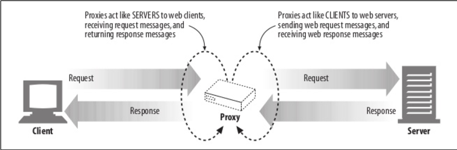

## 공유 프록시
- 대부분의 프록시는 여러 클라가 공용으로 사용
- 캐시 프록시 같은 경우 사용자가 많을 수록 효율이 올라감

## 개인 프록시
- 하나의 클라만 전용으로 이용하는 프록시
- 보통 클라 PC에서 직접 실행되는 형태

## 프록시와 게이트웨이
- 프록시는 같은 프로토콜을 사용하는 둘 이상의 애플리케이션을 연결
- 게이트웨이는 서로 다른 프로토콜을 사용하는 둘 이상의 애플리케이션을 연결


***
# 2. 프록시 사용 이유
- 프록시 서버는 보안 개선, 성능 향상, 비용 절약 등의 이유로 사용
- 모든 HTTP 트래픽을 감시하고 조절할 수 있음

## 웹사이트 필터
- 특정 웹 사이트를 차단하는 필터링 프록시를 사용할 수 있음

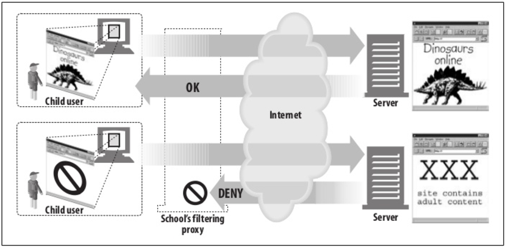

## 문서 접근 제어자
- 많은 웹 서버들과 리소스에 대한 단일 접근 제어 전략을 구현하고 감사 추적 가능
- 각기 다른 조직에서 관리되는 다양한 종류의 웹 서버들에 대한 접근 제어를 
  중앙 프록시 서버에서 설정할 수 있음

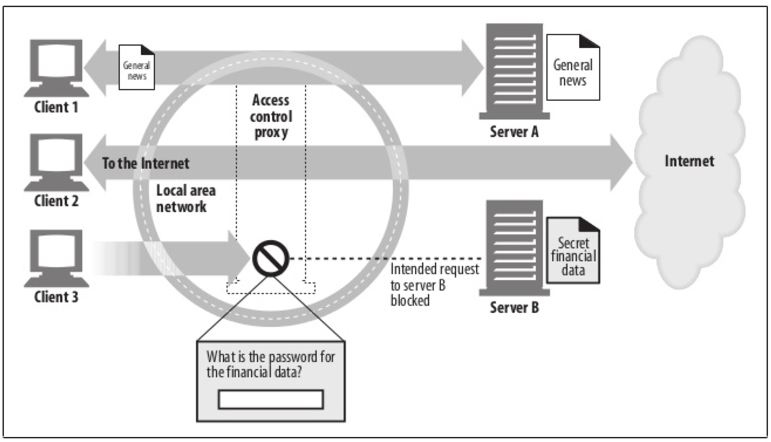

## 보안 방화벽
- 조직안에 들어오거나 나가는 application 레벨 프로토콜의 흐름을 통제
- 바이러스를 제거하는 웹이나 이메일 프록시가 사용할 수 있는, 트래픽을 살펴보는 hook 기능 제공

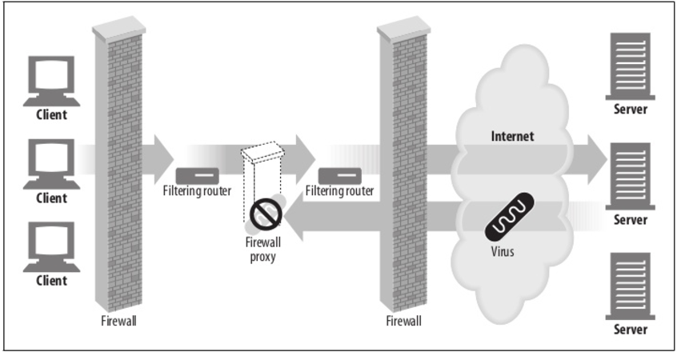

## 웹 캐시
- 인기있는 문서의 로컬 사본을 관리하고 해당 문서 요청이 들어올 시 빠르게 제공

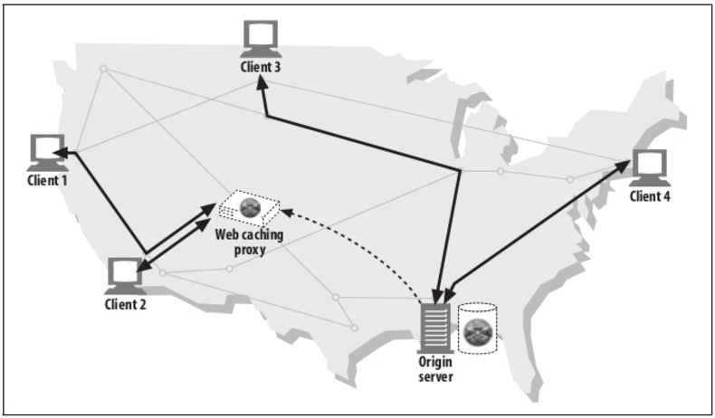

## 대리 프록시(리버스 프록시, 서버 가속기)
- 웹 서버처럼 위장하여 클라에게 요청을 받지만 컨텐츠를 찾기 위해 다른 서버와 통신
- 서버 가속기
  - 공용 컨텐츠에 대한 느린 웹 서버의 성능 개선을 위해 사용
- 리버스 프록시 (<-> 포워드 프록시)
  - 클라이언트를 대신해서 한 대 이상의 서버로부터 자원을 추출하는 프록시 서버
  - 이러한 자원들이 마치 웹 서버 자체에서 기원한 것처럼 해당 클라이언트로 반환
  - 컨텐츠 라우팅 기능과 결합하여 주문형 복제 컨텐츠의 분산 네트워크 구성
  - 관련 서버들을 위해 임의의 클라이언트가 해당 서버에 접속하는 중간 매개체

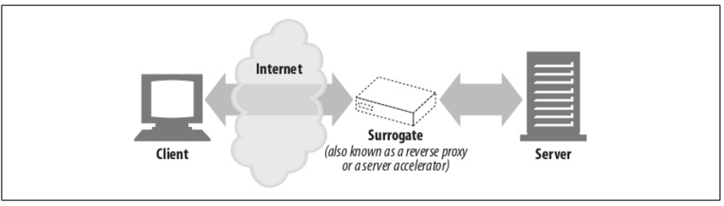

## 컨텐츠 라우터
- 인터넷 트래픽 조건과 컨텐츠 종류에 따라 요청을 특정 웹 서버로 유도
- ex)
  - 더 높은 성능을 위해 돈을 지불한 유저 - 웹 캐시 프록시로 유도
  - 필터링 서비스에 가입한 유저 - HTTP 필터링 프록시를 통과하도록 유도

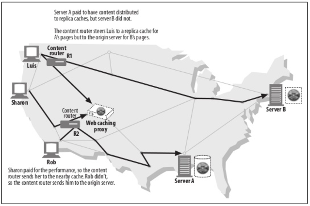

## 트랜스코더
- 프록시 서버는 클라에게 컨텐츠를 전달하기 전에 본문을 수정 가능
- `Transcoding` : 데이터의 표현 방식을 자연스럽게 변환하는 것
- ex)
  - GIF이미지를 JPG로 줄여 데이터 크기 낮추기
  - 이미지 자체의 크기를 줄이기
  - 이미지 색 강도 조절
  - 텍스트 파일 압축 등

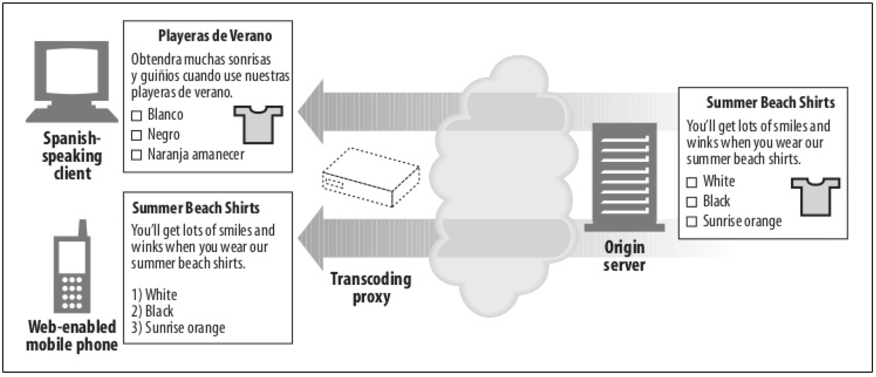

## 익명화 프록시
- HTTP 메세지에서 신원 식별가능한 요소들을 제거
- 개인정보 보호와 익명성 보장
- `User-Agent`헤더에서 사용자의 PC, OS를 제거
- `From`헤더 제거 (사용자 이메일 주소 보호)
- `Referer`헤더 제거 (추적 방지)
- `Cookie`헤더 제거 (프로필, 신원 정보 보호)

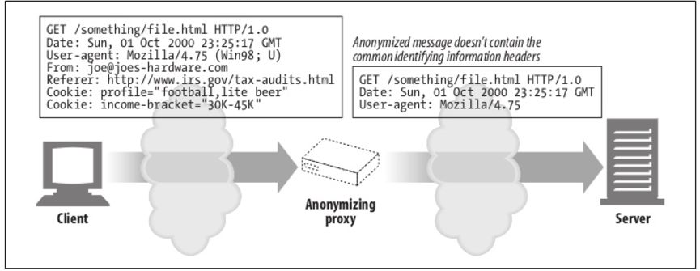

***
# 3. 프록시 배치

## 프록시 서버 배치
  1. 출구(Egress) 프록시
     - 로컬 네트워크와 더 큰 인터넷 사이를 오가는 트래픽을 제어하기 위함
     - 로컬 네트워크의 출구에 배치
     - 방화벽을 제공하거나 트래픽의 성능을 개선하기 위해 사용 가능
  2. 접근(입구) 프록시
     - 모든 요청을 종합적으로 처리하기 위함
     - ISP 접근 지점에 배치
     - ISP는 유저들의 다운로드 속도를 개선
     - 대역폭 비용을 줄이기 위해 캐시 프록시 이용
  3. 대리 프록시
     - 웹 서버 바로 앞에 배치
     - 서버로 향하는 모든 요청을 처리하고 필요할 때만 본 서버에 자원 요청
     - 서버에 보안 기능 추가, 캐시 성능 기대 가능
     - 보통 본 서버의 이름과 IP로 위장하므로 외부 요청들은 프록시로 향함
  4. 네트워크 교환 프록시
     - 캐시를 이용해 인터넷 교차로의 혼잡을 완화하고 트래픽 흐름을 감시하기 위함
     - 충분한 처리 능력을 갖춘 프록시를 네트워크 사이 인터넷 피어링 교환 지점에 배치

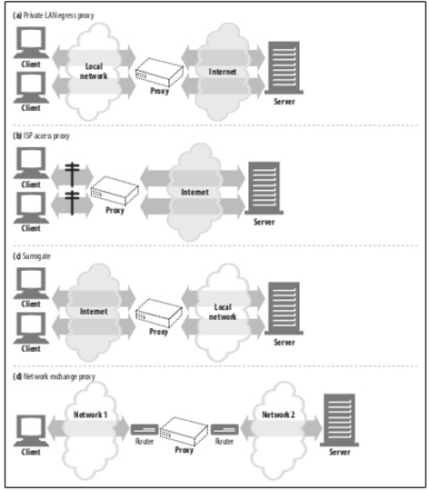

## 프록시 계층
- 프록시는 여러개가 연쇄적으로 연결될 수 있음
- 클라와 가까운 아웃바운드쪽 일수록 자식 프록시
- 서버와 가까운 인바운드쪽 일수록 부모 프록시

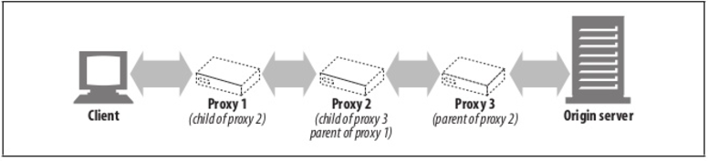

- 프록시 계층은 항상 정적이지 않고 상황에 따라 동적일 수도 있음  
  (단 하나의 부모 프록시뿐만이 아니라 본 서버나 다른 프록시를 부모로도 가질 수 있음)
- 동적 부모 프록시의 종류
  - 부하 균형 - 자식 프록시는 부하 분산을 위해 작업량이 적은 부모 프록시에게 연결
  - 지리적 인접성 - 본 서버의 지역을 담당하는 부모 프록시에게 연결
  - 프로토콜/타입 - 특정 URI를 갖는 요청의 경우 특정 프록시로 연결
  - 유료 서비스 가입자 - 속도 개선용 캐시 프록시, 성능 개선용 압축 프록시로 연결

## 프록시의 트래픽 처리
- 클라의 트래픽이 프록시로 가도록 만드는 방법
1. 클라수정
     - 브라우저같은 웹 클라들은 프록시 설정을 지원
     - 프록시 사용 설정으로 되어있다면 HTTP 요청은 본 서버가 아닌 프록시로 전송
2. 네트워크 수정 (인터셉트 프록시, 투명 프록시)
     - 클라는 간섭할 수 없는 상태에서, 네트워크 인프라를 가로채 프록시로 전송
     - HTTP 트래픽을 지켜보고 가로채어 클라가 모르게 프록시로 보냄
     - 해당 역할을 하는 스위칭 장비나 라우터 필요
3. DNS 이름공간 수정
     - 리버스 프록시는 웹 서버의 이름, IP를 그대로 사용
     - 모든 요청은 서버 대신 리버스 프록시로 전송됨
4. 웹 서버 수정
     - 서버는 HTTP 리다이렉션 명령으로 응답하면서 클라의 요청을 프록시로 리다이렉트
     - 리다이렉션 응답을 받은 클라는 바로 프록시와 트랜잭션 시작

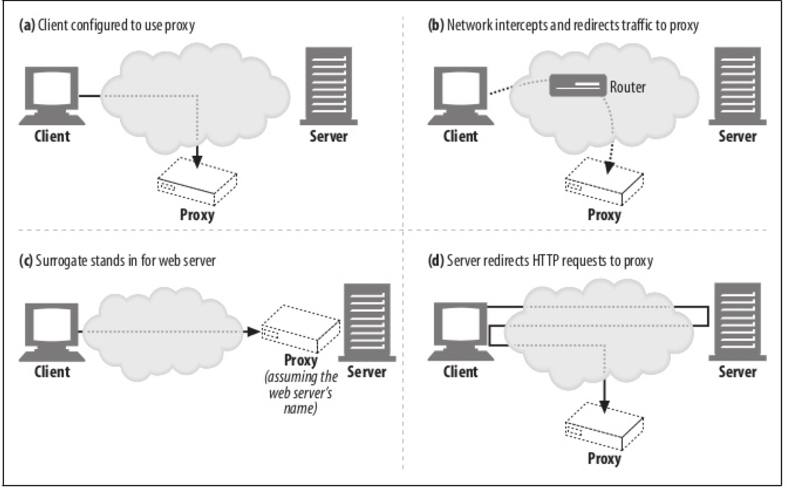

***
# 4. 클라이언트 프록시 설정
## 수동 설정
- 대부분의 브라우저는 프록시를 수동으로 설정가능
- ex)
  - 크롬: 설정 > 고급 설정표시 > 프록시 설정 변경
  - 익스플로러: 도구 > 인터넷 옵션 > 연결 > LAN 설정 > 사용자 LAN에 프록시 사용
- 몇몇 ISP는 요구에 맞춰 미리 설정된 브라우저나  
  웹 트래픽을 프록시 서버로 리다이렉트 하는 OS사용
- 단 하나의 프록시 밖에 설정할 수 없음

## 클라 프록시 설정 - PAC 파일
- 프록시 설정을 상황에 맞게 계산해주는 작은 JS 프로그램
- 문서에 접근할 때마다 JS 함수가 적절한 프록시 서버 선택
- PAC file의 URI를 브라우저에 설정함으로써 사용가능
- PAC 파일 : `.pac` 확장자, `application/x-ns-proxy-autoconfig` MIME 타입
- 해당 PAC 파일은 프록시 서버를 계산해주는 `FindProxyForUrl(url, host)`함수를 정의

| 반환값 | 설명 |
| :---- | :--- |
| DIRECT | 프록시 없이 연결이 직접 이루어짐 |
| PROXY host:port | 지정한 프록시를 사용 |
| SOCKS host:port | 지정한 SOKCS 서버를 사용 |
```
function FindProxyForUrl(url, host) {
  if (url.substring(0,5) == "http:") {
    return "PROXY http-proxy.mydomain.com:8080";
  } else if (url.substring(0,5) == "ftp:") {
    return "PROXY ftp-proxy.mydomain.com:8080";
  } else {
    return "DEIRECT";
  }
}
```

## 클라 프록시 설정 - WPAD
- 웹 프록시 자동발견 프로토콜
- WPAD는 브라우저에게 알맞은 PAC파일을 자동으로 찾아주는 알고리즘
***
# 5. 프록시 요청의 특징

## 프록시 서버와 URI, 본 서버의 URI
- 웹 서버와 프록시 서버의 메세지 문법은 같으나 요청 URI가 다름
```
클라에서 본 서버로 보낼 때
GET /index.html HTTP/1.0
User-Agent: SuperBrowserv1.3

클라에서 프록시 서버로 보낼 때
GET http://www.mary-antiques.com/index.html HTTP/1.0
User-Agent: SuperBrowserv1.3
```
- 클라가 본 서버와 직접 HTTP 통신할 떄에는 서버의 호스트명과 포트번호를 알고 있음
- 클라는 불필요한 정보 발송을 피하기 위해 스킴, 호스트, 포트번호가 없는 '부분 URI'사용
- 프록시는 목적지 서버와 커넥션을 맺어야 하므로 해당 서버의 정확한 주소 필요
- 또한 프록시 기반 게이트웨이는 해당 서버의 스킴을 알아야 함

## 가상 호스팅에서의 비슷한 문제
- 가상으로 호스팅 되는 웹 서버는 여러 웹 사이트가 같은 물리적 웹 서버 공유
- 가상 호스팅 웹 서버는 호스트, 포트 정보가 담긴 `Host` 헤더를 요구  
  (05_웹서버.md - ## 가상 호스팅 된 Docroot 참조)

## 대리 프록시, 인터셉트 프록시(투명 프록시)
- 클라는 투명 프록시의 존재를 모르기에 프록시에게 부분 URI를 보냄
- 대리 프록시는 본 서버의 주소를 그대로 쓰기 때문에 클라는 프록시라고 인지를 못하므로  
  프록시에게 부분 URI를 보냄

## 프록시의 요청 처리
- 트래픽이 프록시로 리다이렉트 될 수 있는 여러 상황이 존재
- 때문에 프록시는 완전한 URI, 부분 URI를 모두 처리할 수 있어야 함
- URI 사용 규칙
  - 완전 URI일시 프록시는 해당 URI를 사용
  - 부분 URI, Host 헤더가 있으면 Host 헤더를 통해 원 서버의 이름, 포트를 알아냄
  - 부분 URI이지만 Host 헤더가 없으면 다음의 방법으로 진행
    - 대리 프록시일 경우 - 프록시에 실제 서버의 주소, 포트 정보사용
    - 이전에 어떤 투명 프록시가 가로챘던 트래픽을 받았고,  
      그 프록시가 본 서버의 주소, 포트를 사용했다면 해당 정보를 이용
    - 모두 아닐 경우 에러 반환

## 전송중 URI 변경
- 일반적으로 프록시 서버는 URI변경에 대해 가능한 관대해야 함
- 사소한 변경이라도 문제를 일으키기 때문
- HTTP명세는 투명 프록시가 URI전달시 절대 경로를 고치는 것을 금지함

## URI 클라이언트 자동확장, 호스트명 분석
- 브라우저는 프록시 존재 여부에 따라 요청 URI를 다르게 분석
- 프록시가 없는 경우 유저가 타이핑한 URI를 가지고 대응하는 IP를 찾음
- DNS에서 호스트명을 찾으면 대응되는 여러 IP를 가지고 연결에 성공할 때까지 시도
- 호스트명을 찾지 못하면 브라우저는 유저가 URI의 짧은 약어를 타이핑했다고 취급하고  
  자동화된 호스트명의 확장 기능 제공
  - 일반적인 웹 사이트의 이름만 입력하면 앞뒤로 `www`, `.com`을 붙여줌
  - 몇몇 브라우저는 해석 불가능한 URI를 서드파티 사이트로 넘겨 해석을 부탁함
  - DNS는 사용자가 호스트명의 앞부분만 입력하면 자동으로 도메인 검색  
    ex) 현재 도메인: `oreilly.com`, 유저 입력: `host7`  
        DNS는 자동으로 `host7.oreilly.com`을 찾음

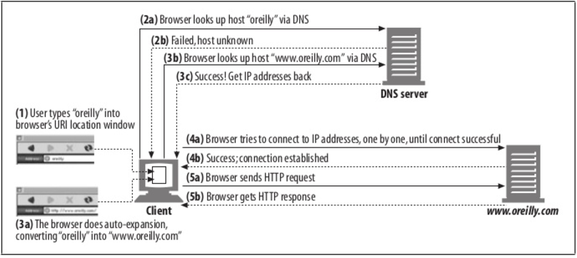

## 명시적인 프록시 URI 분석
- 명시적인 프록시를 사용할 경우 브라우저는 URI 확장기능을 사용할 수 없음

## 투명 프록시 URI 분석
- DNS가 성공할 때 까지 호스트명을 자동확장하는 브라우저를 사용할 경우  
  동작방식은 본 서버와 통신할 때와 차이가 없음
- DNS가 호스트에 대응되는 IP주소들을 찾아 해당 IP들을 기준으로 연결에 시도하지만  
  특정 IP는 죽은 IP일수도 있음
- 투명 프록시로 트래픽이 인터셉트 될 경우 죽은 웹 서버 IP임에도 불구하고  
  프록시 자체는 죽은 것이 아니기 때문에 성공적으로 웹 서버와 대화했다고 믿음
- 때문에 픅로시는 호스트 헤더에 들어있는 호스트명을 다시 분석하거나  
  IP주소에 대한 역방향 DNS 룩업을 통해 다른 IP주소로 연결을 시도해야함

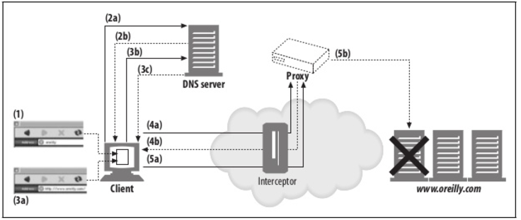

- 투명 프록시나 명시적 프록시 모두 죽은 서버의 DNS 분석에 대한 장애 허용을 지원해야함
***
[TODO: 6. 메세지 추적]
***
[TODO: 7. 프록시 인증]
***
[TODO: 8. 프록시 상호 운용성]
