# 게이트웨이, 터널, 릴레이

# 1. 게이트웨이의 역할
- 웹에 더 복잡한 리소스를 올려야 할 필요가 생기며  
  모든 리소스를 한 개의 애플리케이션으로 처리할 수 없게 됨
- 인터프리터 같이 리소스를 받기 위한 경로로 안내하는 '게이트웨이'를 고안
- 게이트웨이는 HTTP 트래픽을 다른 프로토콜로 변환하여 서버에 접속할 수 있게 해줌

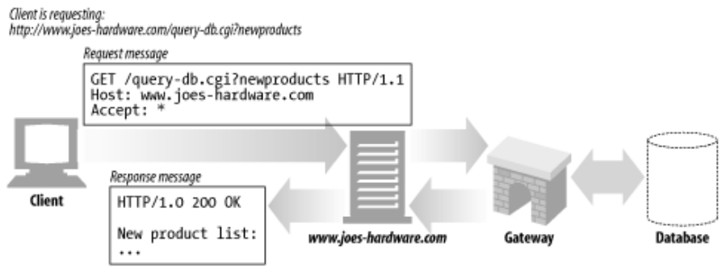
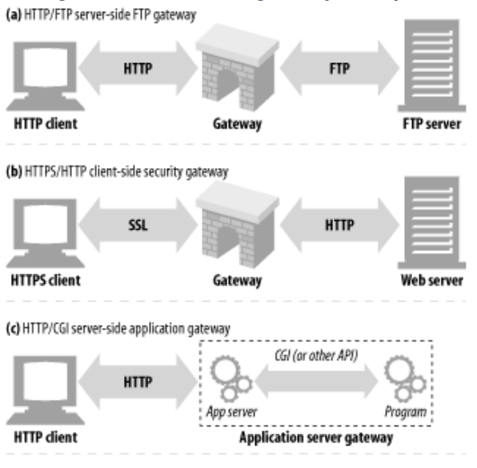

## 클라이언트 측, 서버 측 게이트웨이
- 웹 게이트웨이는 한 쪽에서 HTTP, 다른 쪽에서 다른 프로토콜로 통신
```
# 클라, 서버를 다음처럼 구분
<클라이언트 프로토콜>/<서버 프로토콜>

# ex) HTTP 클라이언트, NNTP 뉴스 서버
HTTP/NNTP
```
***
# 2. 프로토콜 게이트웨이
- 프록시 처럼 게이트웨이에도 HTTP 트래픽을 바로 보낼 수 있음
- 브라우저에 명시적으로 게이트웨이 설정 혹은 게이트웨이를 리버스 프록시로 설정

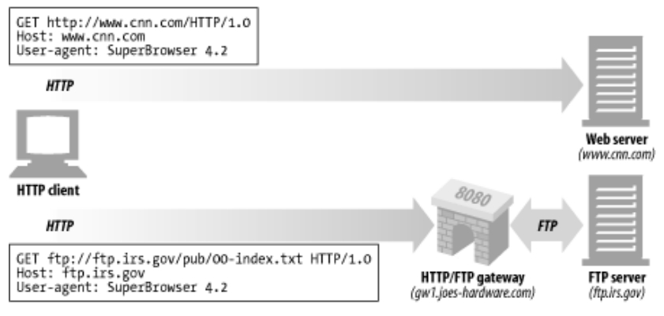

- 일반 HTTP 트래픽은 본 서버로 보내지만 특정 프로토콜 URL은 게이트웨이로 보냄
- 게이트웨이는 HTTP로 받은 요청을 해당 프로토콜로 변환하여 처리후 HTTP로 응답

## HTTP/* : 서버 측 웹 게이트웨이
- 서버 측 웹 게이트웨이는 클라로부터 HTTP요청이 본 서버 영역으로 들어오는 시점에  
  클라 측의 HTTP 요청을 외래 프로토콜로 전환

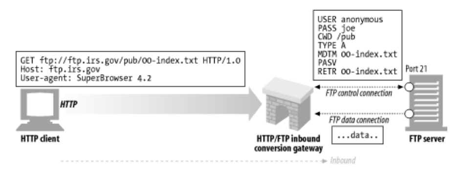

## HTTP/HTTPS : 서버 측 보안 게이트웨이
- 조직 내부의 모든 웹 요청을 암호화함으로써 개인정보 보호, 보안을 제공
- 클라는 일반 HTTP 요청을 사용하지만 게이트웨이는 자동으로 유저의 모든 세션을 암호화

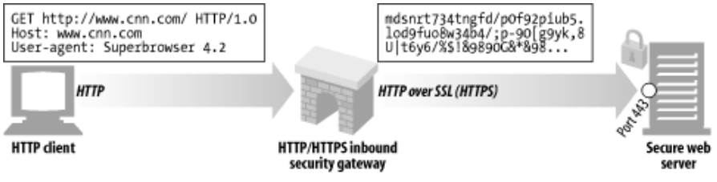

## HTTPS/HTTP : 클라이언트 측 보안 게이트웨이
- 보안가속기라 불리며 웹 서버 앞단에 위치하여 투명 게이트웨이나 리버스 프록시 역할수행
- HTTPS 트래픽을 받아 복호화하고 웹 서버로 보낼 일반 HTTP를 생성
- 효율적으로 보안 트래픽을 다루는 장비를 내장해서 본 서버의 부하를 줄여줌

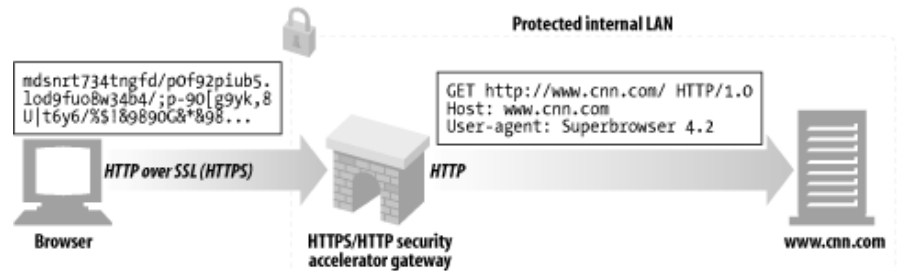

***
# 3. 리소스 게이트웨이
- 게이트웨이의 가장 일반적인 형태
- HTTP를 통해 클라와 통신하고 본 서버측의 애플리케이션 프로그램에 연결하는 서버측 게이트웨이

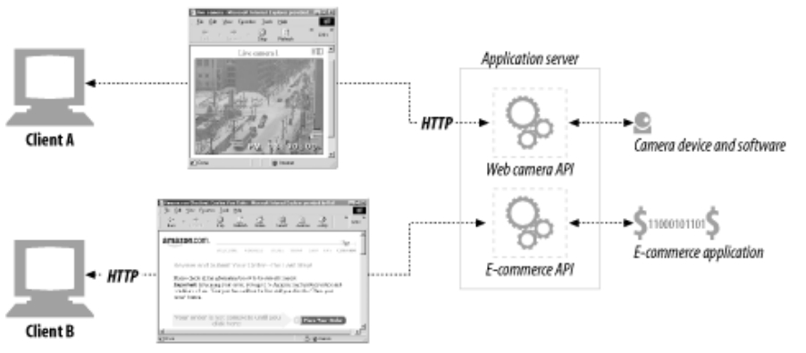

## CGI(Common Gateway Interface) 공용 게이트웨이 인터페이스
- 특정 URL에 대한 HTTP 요청에 따라 프로그램을 실행, 결과 출력 수집, HTTP 응답으로 회신하는  
  표준화된 인터페이스 집합

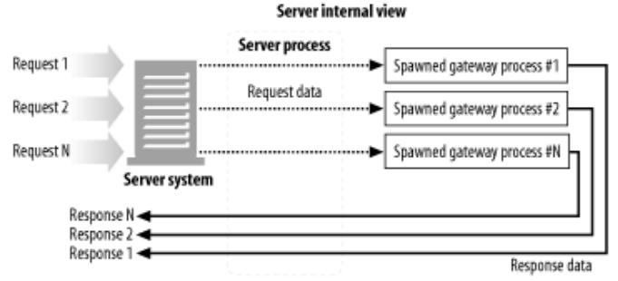

```
# ex)
요청 -> 웹 서버(Apache, Nginx) -> 웹 서버가 직접 실행(C++, Perl 등)
```

- 게이트웨이를 통해야 얻을 수 있는 리소스 요청이 들어오면 서버는 핼퍼 애플리케이션으로 요청 처리
- 이는 웹에서 동적인 HTML, 데이터베이스 질의 등을 제공하는데 사용
- 모든 CGI요청은 새로운 프로세스를 만드는 데 부하가 크고 서버 성능을 크게 제한함

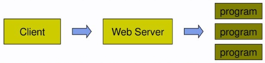
[ref: https://slidesplayer.org/slide/14742126/]

- Fast CGI - CGI와 유사하지만 데몬으로 동작, 요청마다 프로세스를 생성하는 부하를 줄임

## WAS(Web Application Server)
- 웹 서버의 성능을 개선하기 위해 일부 기능을 분리
- 웹 서비스의 처리를 위한 동적 리소스나 비지니스 로직을 담당
- 스레드 방식을 사용해 요청에 따른 프로세스 생성의 부하가 덜함

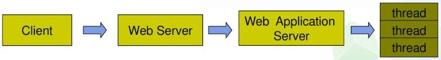
[ref: https://slidesplayer.org/slide/14742126/]

***
# 4. 터널
- 'HTTP 프로토콜을 지원하지 않는 애플리케이션'에 HTTP 애플리케이션으로 접근  
  즉, HTTP 커넥션을 통해 HTTP가 아닌 트래픽을 전송할 수 있음  
  (다른 프로토콜을 HTTP 위에 올릴 수 있는 것)
- HTTP만을 허용하는 방화벽이라도 다른 트래픽을 보낼 수 있음

## CONNECT
- HTTP의 `CONNECT` 메서드를 사용하여 터널 커넥션을 맺음
- CONNECT 메서드는 터널 게이트웨이가 임의의 서버와 포트에 TCP 커넥션을 맺고  
  클라 - 서버 간의 데이터를 무조건 전달하기를 요청

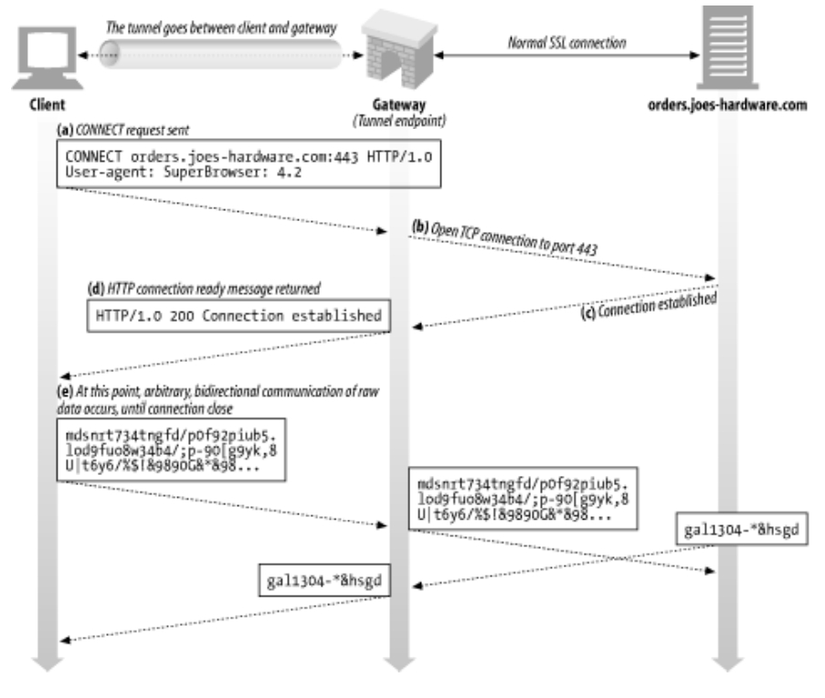

- CONNECT 요청
  - 문법은 시작줄을 제외하고 다른 HTTP 메서드와 동일
  - URI는 호스트 명이 대신하며 콜론에이어 포트를 기재
  ```
  CONNECT home.netscape.com:443 HTTP/1.0
  User-Agent: Mozilla/4.0
  ```
- CONNECT 응답
  - 200 상태코드로 연결 되었음을 확인
  ```
  HTTP/1.0 200 Connection Established
  Proxy-agent: Netscape-Proxy/1.1
  ```

## SSL 터널링
- 터널을 사용하면 SSL 트래픽을 HTTP 커넥션으로 전송하여 HTTP만을 허용하는 방화벽 통과 가능
- HTTP 메세지에 암호화된 raw 데이터를 담고 일반 HTTP 채널을 통해 전송

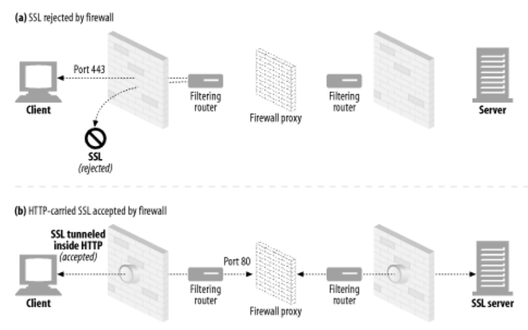

- 보안 SSL 트래픽이 방화벽을 통과하는데 유용
- 하지만 악의적인 트래픽이 조직으로 유입되는 경로가 될 수도 있음

## SSL 터널링 vs HTTP/HTTPS 게이트웨이
- HTTPS(SSL상의 HTTP)은 다른 프로토콜과 같은 방식으로 게이트웨이를 통과
- HTTP/HTTPS (클라이언트 <-http-> 게이트웨이 <-https-> 웹 서버)
  - 클라 <-> 게이트웨이 사이에는 보안 미적용
  - 프록시가 인증을 담당하므로 본 서버에 SSL 클라이언트 인증 불가
  - 게이트웨이는 SSL을 완벽 지원해야함
- SSL 터널
  - 프록시는 SSL를 구현할 필요 없음
  - SSL 세션은 클라가 생성한 요청과 본 서버간에 생성됨
  - 프록시 서버는 트랜잭션의 보안을 신경 안쓰고 암호화된 raw 데이터만 터널링

## 터널 인증
- 프록시 인증 기능은 클라가 터널을 사용할 수 있는 권한을 검사하는 용도로 사용 가능
- CONNECT과정에서 TCP커넥션전에 인증요구를 받 아서 Proxy-authorization으로 인증정보를 받음

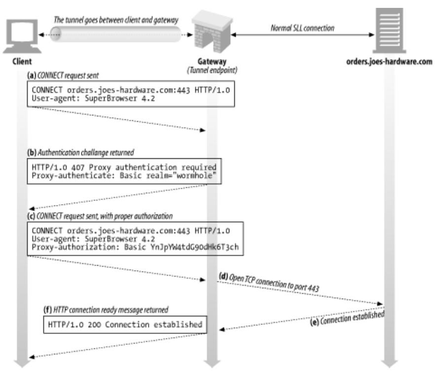

- 터널 게이트웨이는 통신하는 프로토콜이 터널을 올바르게 사용하는지 판단 불가
- 때문에 잘 알려진 포트만 터널링 허용

***
# 5. 릴레이
- HTTP 명세를 준수하지 않는 간단한 HTTP 프록시
- HTTP 커넥션을 맺은 후 바이트만을 맹목적으로 전달
- 모든 헤더와 메서드 로직을 수행하지 않고 맹목적으로 트래픽을 전달

## keep-alive hang
- 릴레이 구현시 Connection 헤더를 제대로 처리하지 못해서 keep-alive 커넥션이 행에 걸림


- Connection 헤더는 `hop-by-hop`에만 사용하는 헤더
- 단일 전송 링크만을 지원하고 다음 커넥션으로 전달하면 안됨
- 본 서버와 릴레이 사이에 커넥션이 끊이지 않지만 릴레이는 해당 커넥션이 끊기기를 기다림
- 때문에 클라에서는 유지되는 커넥션으로 요청을 보내지만 답이 오지 않음
