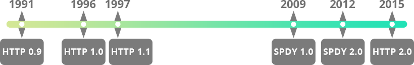
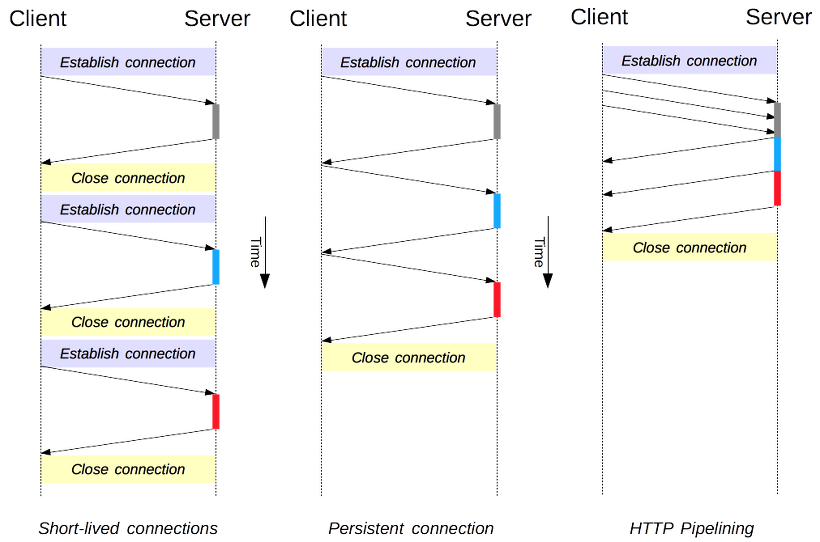
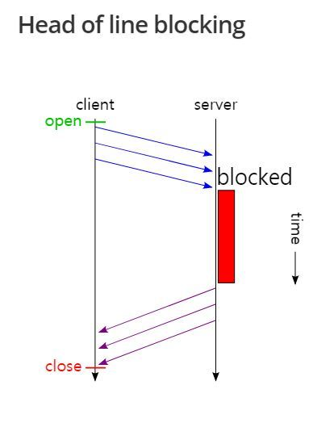
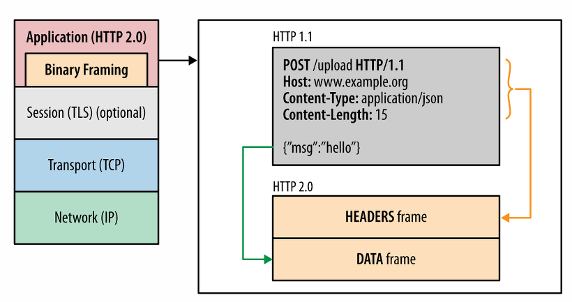
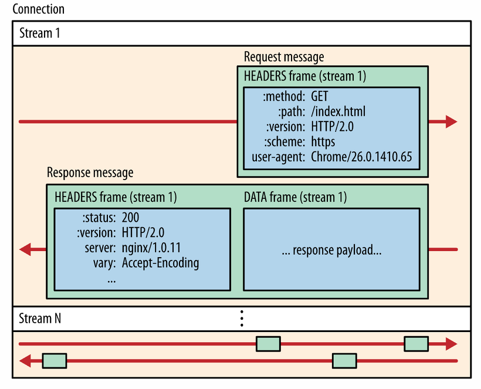
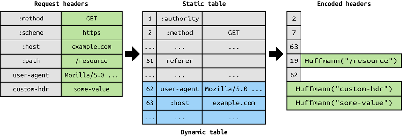
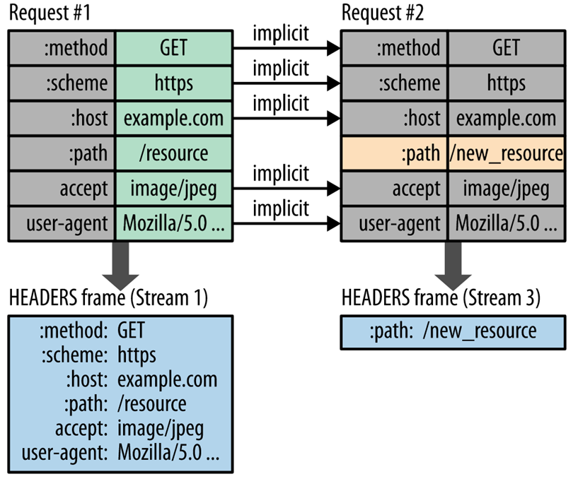
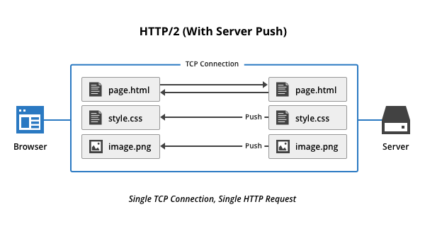

# HTTP 2.0
## 등장 배경
- HTTP/1.1의 메시지 포맷은 구현의 단순성과 접근성에 주안을 두면서 성능을 어느정도 희생
- 커넥션 하나를 통해 요청 하나, 응답 하나만 받는 단순함
- 응답을 받아야만 다음 요청을 보낼 수 있는 '회전 지연' 발생
- 병렬 커넥션, 파이프 라인 커넥션 등의 대비책은 근본적인 부분을 해결하지 못함

- 구글의 `SPDY`(헤더 압축, TCP 커넥션 하나에 여러 요청 첨부, 서버가 능동적으로 푸시)
- HTTP/2.0은 SPDY를 기반으로 하여 제작
***
# 개요


- HTTP 1.1은 1997년
- HTTP 2는 2015년 5월 공개
- 현재는 예전보다 처리해야하는 리소스의 양이 많아졌으며 동적 컨텐츠도 많이 처리함

- 간략한 특성들
  - HTTP/2.0은 서버와 클라이언트 사이의 TCP 커넥션 위에서 동작
  - TCP 커넥션을 초기화는 것은 클라이언트
  - HTTP/2.0 요청과 응답은 길이가 정의된(최대 16383바이트) 한 개 이상의 프레임으로 구성 (HTTP 헤더도 압축되어 담김)
  - 프레임들에 담긴 요청, 응답이 스트림을 통해 전달됨
  - 한 개의 스트림이 한 쌍의 요청과 응답을 처리
  - 하나의 커넥션 위에 여러 개의 스트림이 동시에 만들어질 수 있음
  - 때문에 여러개의 요청과 응답을 동시에 처리 가능
  - 또한 스트림 각각의 흐름제어와 우선순위 설정 가능

  - 서버 푸시를 도입하여 능동적으로 클라에게 데이터 전달 가능

## HTTP 1이 느린 이유
- 회전 지연
  - 앞서 날렸던 요청의 응답을 받아야만 다음 요청이 처리됨

  

  - 이를 대비해서 지속커넥션, 병렬커넥션, 파이프라이닝 등이 나오긴 했으나  
    요청을 보낸 순서대로 응답을 받아야 하는 경우 문제가 발생

  - Head of line blocking : 처음에 요청한 부분에 문제가 있어서 응답이 늦어지면 그 뒤의 요청의 응답도 같이 늦어짐

  

- 한 개의 요청당 하나의 리소스
  - 한 번의 커넥션 맺음에 있어서 한 번의 응답처리만을 받을 뿐이었음
***
# HTTP/2.0의 특징
***
# 프레임
- HTTP/2.0의 메시지는 `프레임`여러개가 모여 구성됨



- 9바이트의 헤더로 시작하며 뒤이어 최대 16384바이트 크기의 페이로드로 구성됨
```
 +-----------------------------------------------+
 |                 Length (24)                   |
 +---------------+---------------+---------------+
 |   Type (8)    |   Flags (8)   |
 +-+-------------+---------------+-------------------------------+
 |R|                 Stream Identifier (31)                      |
 +=+=============================================================+
 |                   Frame Payload (0...)                      ...
 +---------------------------------------------------------------+
```
## 각 헤더 필드
  - 길이 : 페이로드의 길이를 나타내는 unsigned 값. 프레임 헤더 길이는 미 포함  
    (`SETTINGS_MAX_FRAME_SIZE` default : 2^14(16384)보다 크면 안됨)
  - 종류 : 프레임의 종류
  - 플래그 : 8비트 플래그, 프레임의 종류별로 플래그의 의미가 달라짐
  - R : 예약된 1비트 필드, 값의 의미가 정의되어 있지 않으며 반드시 0이어야 함. 수신자는 이 값을 무시해야 함

  - 스트림 식별자 : 0은 커넥션 전체와 관련이 있는 프레임을 의미

- HTTP/2.0은 10가지 프레임을 정의하고 있으며 페이로드의 형식이나 내용은 프레임의 종류에 따라 다름
  - 참고 : https://httpwg.org/specs/rfc7540.html#FrameTypes
  
  - DATA
  - HEADERS
  - PRIORITY
  - RST_STREAM
  - SETTINGS
  - PUSH_PROMISE
  - PING
  - GOAWAY
  - WINDOW_UPDATE
  - CONTINUATION
***
# 스트림과 멀티플렉싱

## 스트림
- 클라이언트와 서버 사이에서 교환되는 프레임들(한 개 이상의 메시지)의 독립된 양방향 시퀀스 
  
- Frame → Message → Stream
- 한 쌍의 HTTP 요청, 응답은 하나의 스트림을 통해 이루어짐
- 클라이언트는 새 스트림을 만들어 HTTP 요청을 보냄
- 서버는 요청시 사용했던 스트림으로 응답을 보내고 해당 스트림은 닫힘



- 하나의 커넥션에서 여러개의 스트림이 동시에 열릴 수 있음

## 동작 방식
  1. Client가 스트림을 생성
       - HTTP Header 정보가 들어있는 HEADERS 프레임을 날려서 생성
       - 헤더를 다 보낼 때 END_HEADER flag를 설정해서 보냄

  2. POST 형식의 엔티티를 보낼 시
       - DATA 프레임을 추가로 전달하고 END_STREAM flag를 설정하여 요청을 종료
       - 보낼 데이터가 없었다면 HEADERS 프레임에 END_HEADERS와 END_STREAM을 둘다 설정

  3. END_STREAM 으로 인해서 half-closed 상태가 되고 client는 더 이상 스트림에 요청 불가
       - 서버가 응답할 차례
       - 스트림을 통해 요청, 응답 한 쌍의 메시지 전달이 일어남을 

  4. 서버는 HEADERS 프레임을 통해 response header를 보냄
       - response header를 다 보냈다면 END_HEADE를 설정해서 보냄

  5. 서버는 DATA 프레임을 통해서 요청에 대한 응답 내용을 보냄
       - 끝나면 END_STREAM flag 설정
       - 보낼 데이터가 없었다면 HEADERS 프레임에 END_STREAM flag 설정해서 보냄

  6. 스트림 종료 !

- 데이터를 보낼 때는 프레임단위로 쪼개서 보냄
- client는 서로 다른 요청을 나타내는 스트림의 프레임을 마구잡이고 보내고 서버가 스트림별로 정리하여 재해석
- 해당 스트림에 대한 응답이 먼저 준비되는 순서대로 응답하므로 Head of line Block 문제 해결
- 특정 요청 처리가 오래 걸려도 다른 요청 처리는 문제 없으므로 응답을 받을 수 있음

## 스트림 우선순위
- 필요할 경우 스트림에 우선순위를 설정할 수 있음
- 네트워크 대역폭이 충분하지 않아 프레임의 전송이 느리다면 중요한 프레임이 속한 스트림의 우선순위를 높일 수 있음

## 스트림 식별자
- 모든 스트림은 31비트 unsigned 정수로 된 고유한 식별자를 가짐
- 클라이언트가 초기화한 스트림은 홀수, 서버인 경우 짝수를 가짐
- 새로 만들어지는 식별자는 이전 식별자들 보다 큰 값을 가져야함
- 한번 사용한 스트림 식별자는 재사용할 수 없어 고갈되는 경우가 존재 - 커넥션을 다시 맺음

## 흐름제어
- 서버와 클라는 스트림을 상대방과 협상 없이 일방적으로 만듦
  - 스트림을 만들 때 협상을 위해 TCP 패킷을 주고 받는 시간 낭비를 없앰
- 여러 개의 스트림을 사용하면 스트림이 블록될 수 있지만  
  HTTP/2.0은 `WINDOW_UPDATE` 프레임을 이용해 스트림 간섭에 대한 흐름을 제어
***
# 헤더 압축
- HTTP/2.0에서는 메시지의 헤더를 압축하여 전송
- 헤더는 HPACK 명세(https://httpwg.org/specs/rfc7541.html)를 따라 압축된 뒤 여러 '헤더 블록 조각'으로 쪼개져 전송됨
- 수신하는 쪽에서 이 조각들을 이은 뒤 압축을 풀어 원래의 헤더로 복원

## indexing
- 헤더 압축기능에는 key:value 쌍에대한 인덱싱기능도 포함하고 있어 헤더의 길이를 매우 줄일 수 있음
- ex) `User-Agent` 헤더 값을 커넥션 내에서 한 번 보내고 이 값을 인덱싱 하기로 결정한다면 다음에는 1바이트로 주고받을 수 있음
- 표준에서는 여러 WAS들의 하위호환을 위해 이 값을 HTTP/1.1 때와 같은 형식으로 reformat해서 넘겨줄 것을 의무화



- HEADER를 Header Table로 관리
- 이전 리퀘스트에서 중복으로 선언된 헤더는 인덱스 값만 전송해서 전송해야 하는 데이터 양 최소화
- 새롭게 추가되거나 변경된 헤더는 Huffman 인코딩되어 전송



## 압축 콘텍스트
- 보안을 위해 사용하는 요소
- 수신한 헤더의 압축을 풀면 이에 영향을 받아 바뀜
- 송신 측은 수신 측이 헤더의 압축을 풀어서 압축 콘텍스트가 변경되었다고 가정할 것
- 따라서 헤더를 받은 수신 측은 어떤 경우에도 반드시 압축 해제를 수행해야 함
***
# Server push
- 서버가 하나의 요청에 대해 여러개의 응답을 보낼 수 있음
- 클라가 필요한 리소스가 무엇인지 미리 알고 있을때 유용

- 동작 과정
  - 리소스를 푸시하려는 서버는 먼저 클라에게 자원을 푸시할 것임을 PUSH_PROMISE 프레임을 통해 알려줌
  - 클라가 해당 프레임을 받으면 해당 프레임의 스트림은 클라입장에서 '예약됨(원격)'상태가 됨
  - 이 상태에서 클라는 RST_STREAM 프레임을 보내어 푸시를 거절할 수도 있음 (그 즉시 스트림이 닫힘)
  - 스트림이 닫히기 전까지는 클라는 서버가 푸시하려고 하는 리소스를 요청해서는 안됨




***
# 참고
- HTTP1 (not secure), HTTP2 (only secure) 속도 차이 : https://www.httpvshttps.com/

- HTTP/2.0 RFC spec : https://httpwg.org/specs/rfc7540.html

- HTTP/2.0 RFC HPACK : https://httpwg.org/specs/rfc7541.html
