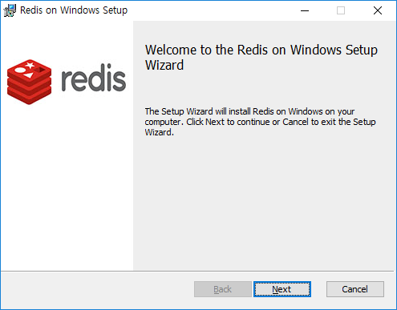

<!-- markdownlint-disable MD033 -->

# Redis_설치

- `Redis default port` : **6379**

***

## 리눅스

- 리눅스에서는 컴파일과 빌드를 거쳐서 레디스 실행 모듈을 생성
- gcc 컴파일러를 사용
- 리눅스 커널 2.6 이상 사용 권장
- [리눅스 공식 홈페이지](https://redis.io)

```cli
wget http://download.redis.io/releases/redis-5.0.4.tar.gz
tar xzf redis-5.0.4.tar.gz
cd redis-5.0.4
sudo make install
```

***

## 윈도우

- [Redis on Windows](https://github.com/MicrosoftArchive/redis)
- 레디스 프로젝트를 Fork하여 윈도우 용으로 제작한 프로젝트

  

***

## 서버 실행

- Redis Server 실행

```cli
$ redis-server
[28032] 01 May 10:39:47.472 # Warning: no config file specified, using the default config. In order to specify a config file use redis-server /path/to/redis.conf
[28032] 01 May 10:39:47.511 # Creating Server TCP listening socket *:6379: bind: No such file or directory
...

               _._
          _.-``__ ''-._
     _.-``    `.  `_.  ''-._           Redis 3.0.1 (00000000/0) 64 bit
 .-`` .-```.  ```\/    _.,_ ''-._
(    '      ,       .-`  | `,    )     Running in standalone mode
|`-._`-...-` __...-.``-._|'` _.-'|     Port: 6379
|    `-._   `._    /     _.-'    |     PID: 11862
 `-._    `-._  `-./  _.-'    _.-'
|`-._`-._    `-.__.-'    _.-'_.-'|
|    `-._`-._        _.-'_.-'    |           http://redis.io
 `-._    `-._`-.__.-'_.-'    _.-'
|`-._`-._    `-.__.-'    _.-'_.-'|
|    `-._`-._        _.-'_.-'    |
 `-._    `-._`-.__.-'_.-'    _.-'
     `-._    `-.__.-'    _.-'
         `-._        _.-'
             `-.__.-'
...
[28032] 01 May 10:39:47.511 # WARNING overcommit_memory is set to 0! Background save may fail under low memory condition. To fix this issue add 'vm.overcommit_memory = 1' to /etc/sysctl.conf and then reboot or run the command 'sysctl vm.overcommit_memory=1' for this to take effect.
```

- `Redis 3.0.1 (00000000/0) 64 bit`
  - 레디스 3.0.1 버전, 64비트 인스턴스

- `Running in standalone mode`
  - 현재 레디스 실행 모드
  - 복제를 위한 클러스터 모드, 독립 모드 지원
  - 현재는 독립모드 상태

- `Port: 6379`, `PID: 11862`
  - 현재 레디스 서버가 접속을 허용하는 포트 번호와 실행중인 프로세스 ID

- `# Warning: no config file specified, using the default config. In order to specify a config file use redis-server /path/to/redis.conf`
  - 레디스 서버 가동 시 아무런 설정 파일도 지정되지 않음

- `# Unable to set the max number of files limit to 10032 (Operation not permitted), setting the max clients configuration to 992`
  - 레디스 프로세스에 연결할 수 있는 최대 클라이언트 개수를 10032개로 지정하는데 실패
  - `redis.conf` 파일을 지정하지 않았기 때문에 default 값인 10032개로 지정하려 함
  - 리눅스 시스템의 프로세스당 file descriptor 개수는 1024개 이므로 발생하는 경고
  - 레디스가 자동적으로 maxclients 값을 992개로 설정 (1024개중 32개는 레디스 내부적으로 사용)

- `# Warning: 32 bit instance detected but no memory limit set. Setting 3 GB maxmemory limit with 'noeviction' policy now`
  - 레디스가 32비트 모드로 실행되고 있는 상황에서 메모리 제한을 설정하지 않음
  - 32 비트 인스턴스는 최대 4GB 메모리 사용가능
  - 레디스가 자동으로 maxmemory의 값을 3GB로 설정한 상태

- `# WARNING overcommit_memory is set to 0! Background save may fail under low memory condition`
  - `overcommit_memory` 설정이 되어있지 않음
  - 가용 메모리가 모자란 상황에서 레디스의 비동기 데이터 저장 프로세스가 실패할 수 있음

- `0 clients connected <0 slaves>, 1179896 bytes in ues`
  - `[0 clients connected]` : 레디스 서버에 연결된 클라이언트 수
  - `[<0 slaves>]` : 레디스 서버에 연결된 슬레이브 수
  - `1179896 bytes in use` : 레디스가 사용하고 있는 메모리 용량
    - 서버의 가용 메모리보다 큰 용량을 할당받으면 하드디스크와 스왑이 발생하여 성능 저하 발생 위험

## 클라이언트 실행

- Redis client 실행

```cli
$ redis-cli
127.0.0.1:6379> info
# Server
redis_version:3.2.100
redis_git_sha1:00000000
redis_git_dirty:0
redis_build_id:dd26f1f93c5130ee
redis_mode:standalone
os:Windows
arch_bits:64
multiplexing_api:WinSock_IOCP
process_id:3700
run_id:42376dfe7c1e0342b3c7f387879716c6618a4b3f
tcp_port:6379
uptime_in_seconds:373
uptime_in_days:0
hz:10
lru_clock:13170943
executable:C:\Program Files\Redis\"C:\Program Files\Redis\redis-server.exe"
config_file:C:\Program Files\Redis\redis.windows-service.conf

# Clients
connected_clients:1
client_longest_output_list:0
client_biggest_input_buf:0
blocked_clients:0

# Memory
used_memory:690432
used_memory_human:674.25K
used_memory_rss:652520
used_memory_rss_human:637.23K
used_memory_peak:690432
used_memory_peak_human:674.25K
total_system_memory:0
total_system_memory_human:0B
used_memory_lua:37888
used_memory_lua_human:37.00K
maxmemory:0
maxmemory_human:0B
maxmemory_policy:noeviction
mem_fragmentation_ratio:0.95
mem_allocator:jemalloc-3.6.0

# Persistence
loading:0
rdb_changes_since_last_save:1
rdb_bgsave_in_progress:0
rdb_last_save_time:1556674442
rdb_last_bgsave_status:ok
rdb_last_bgsave_time_sec:-1
rdb_current_bgsave_time_sec:-1
aof_enabled:0
aof_rewrite_in_progress:0
aof_rewrite_scheduled:0
aof_last_rewrite_time_sec:-1
aof_current_rewrite_time_sec:-1
aof_last_bgrewrite_status:ok
aof_last_write_status:ok

# Stats
total_connections_received:3
total_commands_processed:6
instantaneous_ops_per_sec:0
total_net_input_bytes:167
total_net_output_bytes:17633266
instantaneous_input_kbps:0.00
instantaneous_output_kbps:0.00
rejected_connections:0
sync_full:0
sync_partial_ok:0
sync_partial_err:0
expired_keys:0
evicted_keys:0
keyspace_hits:2
keyspace_misses:0
pubsub_channels:0
pubsub_patterns:0
latest_fork_usec:0
migrate_cached_sockets:0

# Replication
role:master
connected_slaves:0
master_repl_offset:0
repl_backlog_active:0
repl_backlog_size:1048576
repl_backlog_first_byte_offset:0
repl_backlog_histlen:0

# CPU
used_cpu_sys:0.11
used_cpu_user:0.16
used_cpu_sys_children:0.00
used_cpu_user_children:0.00

# Cluster
cluster_enabled:0

# Keyspace
db0:keys=1,expires=0,avg_ttl=0
```

- `info`명령은 레디스가 실행된 이후 각종 통계 정보와 설정 정보 출력

| 그룹              | 설명                     |
| :-------------- | :--------------------- |
| `# Server`      | 실행 중인 레디스 서버의 실행 정보    |
| `# Clients`     | 서버와 연결된 클라이언트들의 통계 정보  |
| `# Memory`      | 메모리 사용 정보 및 메모리 통계 정보  |
| `# Persistence` | 영구 저장소와 관련된 저장 정보      |
| `# Stats`       | 명령 수행과 저장된 키에 대한 통계 정보 |
| `# Replication` | 현재 동작 중인 복제 정보         |
| `# CPU`         | CPU 사용률 통계 정보          |
| `# Cluster`     | 레디스의 클러스터 모드에 대한 정보    |
| `# Keyspace`    | 데이터베이스별로 저장된 키 정보      |

- `redis_version` : 레디스 서버의 버전
- `arch_bits` : 레디스 서버의 아키텍쳐 bits
- `process_id` : 레디스 서버의 프로세스 ID
- `connected_clients` : 레디스 서버에 연결되어있는 클라이언트 커넥션 수
- `connected_slaves` : 복제를 위해 연결되는 슬레이브 노드 수
- `used_memory` : 레디스 서버가 사용하는 메모리의 양 (bytes)
- `used_memory_human` : `used_memory`값을 사람이 보기 쉽게 표현한 값 (MB or GB)
- `used_memory_peak` : 레디스 서버가 최대로 사용했던 메모리 크리 (bytes)
- `used_memory_peak_human` : `used_memory_peak`값을 사람이 보기 쉽게 표현한 값 (MB or GB)
- `mem_fragmentation_ratio` : 레디스 서버에 저장된 데이터 중에 연속되지 않은 메모리 공간에 저장된 비율
- `role` : 마스터-슬레이브 복제 모드에서 동작하는 모드, 단일모드로 동작할 경우 마스터로 표시됨