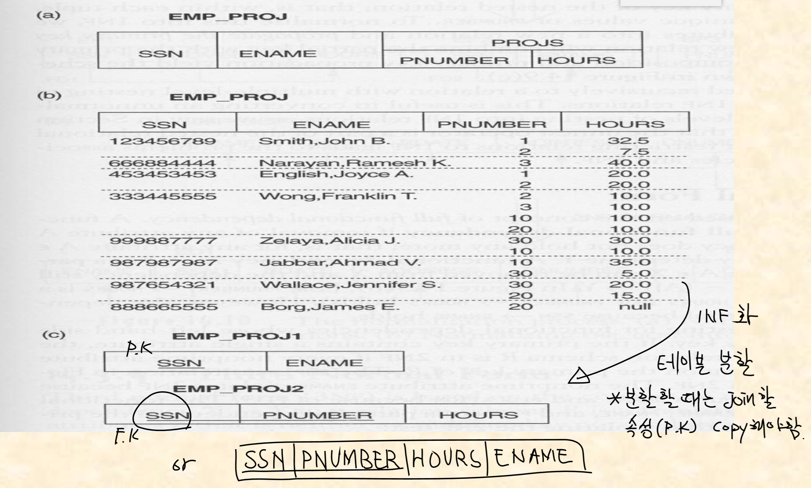
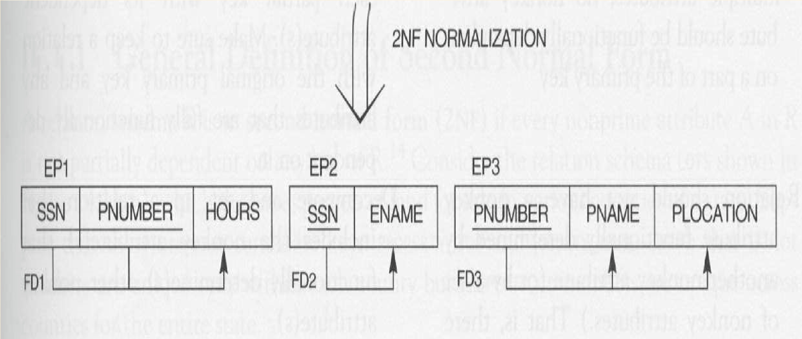
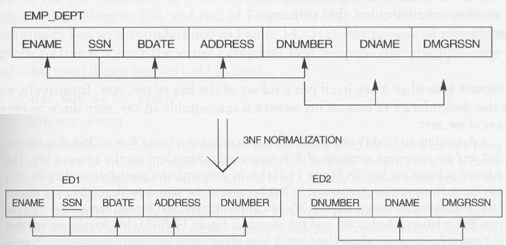

# DB 스터디 정리 19. 4. 6.

* 참고서
	- [SQL 첫걸음] 한빛미디어, 아사이 아츠시 지음, 박준용 옮김
	- [Real MySQL] 위키북스, 이성욱 지음
* 예제 데이터
  - https://github.com/datacharmer/test_db
***
# 34강 데이터베이스 설계
데이터베이스 설계 : 스키마 내의 테이블, 인덱스, 뷰 등의 데이터베이스 객체 정의

## 논리명과 물리명
- 물리명 : `CREATE TABLE`같은 `DDL`에 지정하는 이름
  - 데이터베이스 시스템에 따라 길이의 제한, 공백문자 사용 등의 규칙이 존재
  - 보통 약자로 많이 사용, 물리명만으로는 의미 전달이 힘든 경우 발생
  - ex) item_master
- 논리명 : 설계상의 이름
  - 해당 테이블을 실제로 부르는 이름
  - 쉽게 바꿀 수 있음
  - ex) 상품마스터 테이블

## 자료형
- 테이블의 컬럼에 지정하는 데이터의 유형
- 숫자형 : 수치형 데이터일 경우
- 문자형 : 알파벳이 포함되는 경우
- `CHECK 제약` : 특정 범위 값만 저장되는 경우 지정
  - DBMS에서 데이터의 정합성을 판단할 수 있을 경우 맡기는 것이 편리
  - 애플리케이션에서 따로 구현하면 개발비용 상승, 실수 발생 가능성 존재

## 고정길이와 가변길이
- 고정길이 : 데이터의 자리수가 이미 고정되어있음(정해진 포맷)을 알 경우 사용 ex)제조번호
- 가변길이 : 데이터의 변동이 심할 경우 가변길이 자료형을 이용
- 그 외 : 데이터가 너무 큰 경우 `BLOB`같은 큰 데이터 자료형 사용
  - 단점 - 크기가 너무 크기 때문에 인덱스를 부분적(prefix index)으로만 사용 가능

## 기본키
- 테이블의 행에 유일성을 지정하는 것
- 자동 증가 컬럼으로 이용할 수도 있음

## ER 다이어그램
- 테이블을 설계할 때 테이블 간의 관계를 명확히 하기 위해 쓰이는 설계도
- `Entity`, `Relationship`으로 구성되어 있으며 개체간의 관계를 표현
- `Entity` : 실세계의 물리적 또는 개념적으로 존재하는 것
  - 물리적 : 자동차, 직원, 학생
  - 개념적 : 회사, 직업, 과목

- `Entity Set`, `Entity Type` : 동일한 구조를 갖는 entity의 집합
  - All entities in an entity set have the same set of attributes
  - Each entity set has a key
  - Each attribute has a domain

- `Relationship` : `Entity` 속성간의 관계
- `Relationship Set`, `Relationship Type` : `Entity Type`간의 '관계'
  - `Degree` : the number of participating entity type on relationship type 
  - `types of relationship constraints` : `cardinality ratio` and `participation`
  - `cardinality ratio` : the number of relationship instances that an entity can participate in
    - `1:1` : ex) 부서에는 부서장이 한명이며, 한 부서장은 오직 한 부서만 을 관리한다
    - `1:N` : ex) 부서는 중복없이 하나 씩 존재하며, 각 부서는 여러 명의 직원을 포함하고 있다.
    - `M:N` : ex) 각 직원은 여러 개의 과제를 수행할 수 있고, 각 과제는 여러 직원이 수행할 수 있다
  - `participation` : `entity`의 `relationship type`의 참여 제약조건
    - `total participation` : ex) 만약 회사규정이 모든 직원은 한 부서에서 일해야 한다면
    - `partial participation` : ex) 일부 직원은 다른 직원과 manage라는 관계로 연결됨 

- `weak entity types` : entity type with no key attribute
  - 항상 `total participation` constraint
  - `partial key` : 동일한 owner entity와 연관된 entity를 유일 하게 찾는 key

- `Attribute` : `Entity`의 성질
  - 단순속성, 복합속성
    - `simple(atomic) attributes` : 나눌 수 없는 속성 ex) 사람의 나이 : 오직 한 개의 나이 값
    - `composite attributes` : 기본적인 여러 개의 속성으로 세분화 될 수 있는 속성 ex) 주소

  - 단일속성, 다중속성
    - `single-valued attributes` : 특정 entity에 오직 한 개의 값만을 갖는 속성 
    - `multi-valued attributes` : 한 개 이상의 값을 갖을 수 있는 속성 ex) set-value, 자동차의 색

  - `Attribute`의 형태
    - `stored attributes` : 속성값이 DB에 저장됨
    - `derived attributes` : 다른 속성의 값으로 결정 됨

  - `Null value`
    - `not applicable` : 해당 속성의 값을 적용할 수 없는 경우 ex) 핸드폰 번호 컬럼 -> 핸드폰 없는 사람
    - `not Known` : 1) missing - 컬럼의 값을 '모르는' 경우, 2) not known whether it exists - 컬럼의 값의 존재 여부를 모름

- `ER Diagram`
  - `Entity type` : 직사각형
  - `Attribute` : 타원
  - `Multi valued attribute` : 이중 타원
  - `Relationship Type` : 마름모
  - `total participation` : Entitiy - Relationship 간 이중선
  - `partial participation` : Entitiy - Relationship 간 단선

***
# 35강 정규화
- 정규화란 데이터베이스의 테이블을 규정된 올바른 형태로 개선해나가는 것
- 데이터베이스의 설계 단계에서 행해짐
- Decompose a set of attributes into relations
- bottom-up 설계 : `Universal relation`에서 속성간의 `Functional Dependency(FD)`를 이용해 정규화
- 정규화 단계가 올라갈 수록 중복 데이터가 없어짐, `Update anomaly` 가능성 하락

## Functional Dependency (FD)
- `Universal relation` : 모든 속성을 한 테이블에 놓은 스키마
- `FD X -> Y` : X, Y - set of attributes
  - Y 속성 집합은 X 속성 집합에 의존한다.
  - 레코드에서 X의 값이 정해지면 Y의 값이 따라서 정해지는 상태

## Update Anomaly
- insertion anomalies
- deletion anomalies
- modification anomalies
- 특정 속성값을 수정해도 종속관계에 있는 속성값이 바뀌지 않는 경우
- 잘 짜여진 애플리케이션이 커버할 수 있으나 그러지 못하는 경우도 존재하기 때문에 신경써야함

## 정규화 과정
- lossless join property (no spurious tuple) : 한 쪽이 Primary Key
- dependency preservation property : Functional Dependency가 한 테이블에 존재
- `prime attribute` : an attribute in candidate key (후보가 될 수 있는 속성) <-> `nonprime attribute`

## 제 1 정규형 (First Normal Form : 1NF)
- A relation schema with single atomic attributes
- No multi-valued or composite attributes  
  
- Composite & multi-valued => a nested relation
  
- 1NF를 만족하면 RDB에 데이터를 넣을 수 있는 형태
  
## 제 2 정규형 (Second Normal Form : 2NF)
- FD X -> Y 에서
  - Y is fully dependent on X if A ∈ X and (X-{A})! -> Y  
  - Y is partially dependent on X if A ∈ X and (X-{A}) -> Y
  
- every nonprime attribute in R is not partially dependent on any key of R
  

## 제 3 정규형 (Third Normal Form : 3NF)
- No Update Anomaly
- 2NF & no transitive dependency
- `Transitive dependency`
  - Z = not a subset of any candidate key (non prime key)
  - X -> Z & Z -> Y인 FD가 없는 relation
  

***
# 36강 트랜잭션
- 몇 단계로 나누어 처리되는 SQL명령을 묶어서 처리하는 것
- 여러 명령이 실행되던 중간에 에러가 발생하면 초기 상황으로 되돌아감
- 트랜잭션 내에서 실행하는 복수의 SQL명령은 세트 단위로 유효/무효 처리됨

## 롤백과 커밋
- 트랜잭션을 사용해서 데이터를 추가할 경우 에러가 발생할 수 있음
- `ROLLBACK` : 트랜잭션 내에서 처리된 변경은 없었던 일로 처리됨
- `COMMIT` : 트랜잭션 내에서 에러가 발생하지 않고 무사히 작업을 마쳤을 때 변경사항을 적용하고 트랜잭션 종료

## 자동 커밋
- 기본적으로 `UPDATE`, `INSERT`, `DELETE` 처리시 암묵적으로 자동커밋이 적용됨
- `START TRANSACTION` : 자동커밋을 비활성화하고 트랜잭션의 시작을 알림
- `ROLLBACK`, `COMMIT` 명령을 통해 트랜잭션의 후 처리 진행