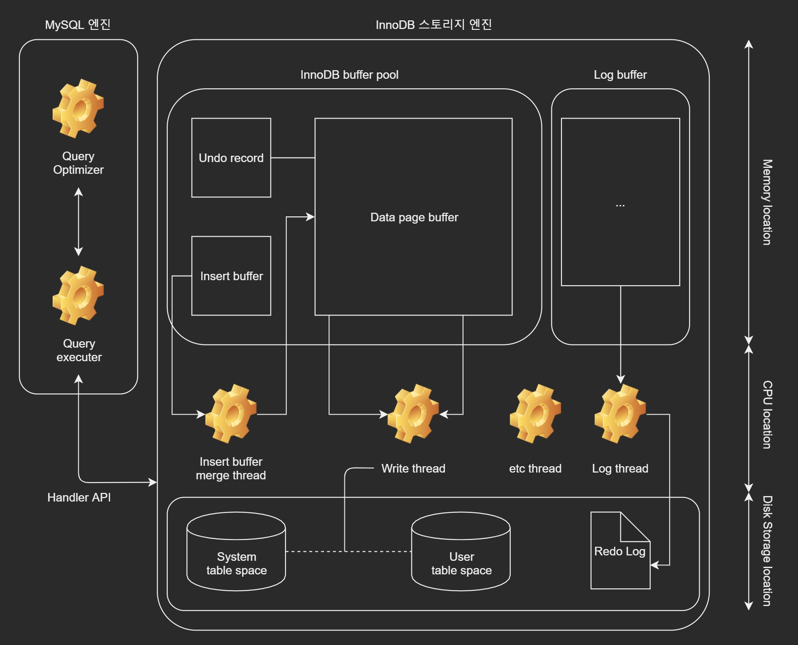

# DB 스터디 정리 19. 4. 10.

* 참고서
	- [Real MySQL] 위키북스, 이성욱 지음
***
# MySQL의 스토리지 엔진
- MySQL 엔진에서 처리를 수행하고 실제 데이터를 디스크 스토리지에 저장하거나 디스크 스토리지로부터 데이터를 읽어오는 부분을 전담
- 스토리지 엔진은 여러 개이며 테이블이 사용할 스토리지 엔진을 지정하면 이후 해당 테이블의 모든 읽기, 쓰기 작업은 정해진 스토리지 엔진이 담당
```
CREATE TABLE TAB_AUTO_INT2_INNODB (
  v1 varchar(10) NOT NULL,
  id2 INT NOT NULL AUTO_INCREMENT,
  PRIMARY KEY (v1, id2),
  UNIQUE KEY (id2)
) ENGINE = InnoDB;
```

# InnoDB
- `InnoDB`는 MySQL의 엔진 중 거의 유일하게 레코드 기반 잠금 기능 제공
- 높은 동시성 처리 가능, 안정성 성능이 뛰어남



## InnoDB 스토리지 엔진의 특성
**1. `PK`에 의한 클러스터링**
- `InnoDB`의 모든 테이블은 기본적으로 `PK`를 기준으로 클러스터링 되어 저장됨 
- `PK`순서대로 디스크에 저장되고 인덱스 레인지 스캔이 빨리 처리됨

**2. 잠금이 필요없는 일관된 읽기 (Non-locking consistent read)**
- MVVC(Multi Version Concurrency Control) 기술을 이용해 락을 걸지 않고 읽기 작업 수행  
- 다른 트랜잭션이 가지고 있는 락을 기다리지도 않고 읽기 가능

**3. 외래 키 지원**
- `MyISAM`, `MEMORY` 스토리지 엔진에서는 사용 불가
- `InnoDB`에서의 외래 키는 부모, 자식 테이블의 해당 키가 모두 인덱스가 필요
- 변경 시 부모, 자식 테이블로 연쇄적으로 체크하므로 잠금이 전파되어 데드락 유발 가능성 높음

**4. 자동 데드락 감지**
- 그래프 기반의 데드락 체크 방식을 사용하기 때문에 데드락이 발생함과 동시에 감지됨  
  [TODO: 그래프 기반 데드락?]
- 감지된 데드락은 관련 트랜잭션 중 `ROLLBACK`이 가장 용이한(가장 작업이 덜 들어가는) 트랜잭션을 강제 종료
  
**5. 자동화된 장애 복구**
- MySQL 서버가 시작될 때 완료되지 못한 트랜잭션이나 디스크에 일부만 기록된 데이터 페이지(Partial Write)등에 복구작업 자동 시행

## InnoDB 버퍼 풀
- DBMS는 `ACID`를 보장하기 위해 즉시 변경된 내용을 데이터 파일로 기록해야하지만 랜덤하게 디스크 I/O가 발생하므로 버퍼 사용
- 디스크의 데이터 파일이나 인덱스 정보를 메모리에 캐시해 두는 공간
- 쓰기 작업을 지연시켜 일괄 작업으로 처리할 수 있게 해주는 버퍼 역할도 겸함  
- 디스크 데이터 파일의 이곳 저곳에 위치한 레코드를 변경하는 작업을 모아서 처리함으로써 랜덤한 디스크 작업 횟수 감소
- 백그라운드 작업의 기반이 되는 메모리 공간
- 디스크에 기록되지 않은 변경된 데이터를 가지고 있음
  - 더티 페이지 : 변경된 데이터가 포함된 페이지
  - `InnoDB`에서 주기적 혹은 특정 조건에 따라 체크 포인트 이벤트 발생
  - Write스레드가 필요한 만큼 더티 페이지를 디스크로 기록

## Undo 로그
- `UPDATE`, `DELETE` 같은 문장으로 데이터를 변경할 때 변경되기 전의 데이터를 보관하는 곳
- 두 가지 용도
  1. 트랜잭션의 `ROLLBACK`대비용 이전 데이터 보관
  2. 트랜잭션의 격리 수준을 유지하면서 높은 동시성을 제공하는데 사용
    - 격리 수준 :  MySQL의 InnoDB는 기본적으로 `REPETABLE_READ`  
      동시에 여러 트랜잭션이 데이터를 변경하거나 조회할 때,  
      한 트랜잭션의 작업 내용이 다른 트랜잭션에 어떻게 보여질지 결정하는 기준  
      (study190409.md - 트랜잭션 > 격리수준 참조)
- **주의** : 트랜잭션을 오래 열어둘 경우 `Undo log`에 막대한 양의 정보가 쌓이게 됨

## Insert 버퍼
- 데이터 파일을 변경할 뿐만 아니라 해당 테이블에 포함된 인덱스를 업데이트할 때 버퍼를 사용
- 변경해야 할 인덱스 페이지가 버퍼 풀에 있으면 바로 업데이트를 수행
- 디스크로부터 읽어와서 업데이트 해야 하면 임시공간(`Insert Buffer`)에 저장 후 사용자에게 결과를 반환
- 결과 반환전에 중복 여부를 체크해야 하는 유니크 인덱스는 이를 사용할 수 없음
- 인서트 버퍼에 임시로 저장된 인덱스 레코드 조각은 백그라운드 스레드인 인서트 버퍼 머지 스레드에 의해 병합됨

## Redo 로그 및 로그 버퍼
- `InnoDB buffer pool`만으로는 `ACID`를 보장할 수 없기 때문에 변경된 내용을 순차적으로 디스크에 기록하는 로그 파일 존재
- DBMS는 리두 로그와 버퍼링을 통해 한꺼번에 디스크에 변경된 내용 처리 가능
- 변경작업이 많은 DBMS 서버는 리두 로그 기록작업에 부하가 커서 `ACID`를 보장하는 수준에서 로그 버퍼를 이용해 버퍼링 처리

## MVCC(Multi Version Concurrency Control)
- 잠금을 사용하지 않는 일관된 읽기를 제공하기 위해 사용
- `InnoDB`는 `Undo Log`를 통해 구현
- Multi Version : 하나의 레코드에 대해 여러 개의 버전이 동시에 관리됨
```
# 격리수준 - READ_COMMITEED
CREATE TABLE member (
  m_id INT NOT NULL,
  m_name VARCHAR(20) NOT NULL,
  m_area VARCHAR(100) NOT NULL,
  PRIMARY KEY (m_id),
  INDEX ix_area (m_area)
);

INSERT INTO member (m_id, m_name, m_area) VALUES (12,'홍길동','서울');
COMMIT;
```
- 위 쿼리를 실행했을 때 데이터베이스의 모습은 다음과 같음
```
# 메모리 영역
  InnoDB 버퍼 풀
  +----------+------+--------+--------+
  | 관리 정보 | m_id | m_name | m_area |
  +----------+------+--------+--------+
  |    ...   |  12  |  홍길동 |  서울  | 
  +----------+------+--------+--------+

  Undo 로그
  - 이전에 아무 작업도 없어서 비어있다고 가정

# 디스크 영역
  +----------+------+--------+--------+
  | 관리 정보 | m_id | m_name | m_area |
  +----------+------+--------+--------+
  |    ...   |  12  |  홍길동 |  서울  | 
  +----------+------+--------+--------+
```
- 이때 다음의 `UPDATE` 쿼리를 실행하면
```
UPDATE member SET m_area = '경기' WHERE m_id = 12;
```
```
# 메모리 영역
  InnoDB 버퍼 풀
  +----------+------+--------+--------+
  | 관리 정보 | m_id | m_name | m_area |
  +----------+------+--------+--------+
  |    ...   |  12  |  홍길동 |  경기  | <-
  +----------+------+--------+--------+

  Undo 로그
  +----------+------+--------+--------+
  | 관리 정보 | m_id | m_name | m_area |
  +----------+------+--------+--------+
  |    ...   |  12  |  홍길동 |  서울  | <-
  +----------+------+--------+--------+

# 디스크 영역
  +----------+------+--------+--------+
  | 관리 정보 | m_id | m_name | m_area |
  +----------+------+--------+--------+
  |    ...   |  12  |  홍길동 |   ???  | <-
  +----------+------+--------+--------+
```
- `UPDATE`문이 실행되면 `COMMIT`여부와 상관없이 `InnoDB buffer pool`은 새로운 값으로 갱신됨
- 디스크 데이터 파일에는 체크포인트나 Write 스레드에 의해 갱신 되어있을수도.. 아닐수도..  
  (InnoDB는 ACID를 보장하므로 동일한 상태라고 봐도 무방)
- **아직 `COMMIT` 혹은 `ROLLBACK` 명령이 오기 전**에 다른 커넥션에서 작업중인 레코드를 조회하면?
```
SELECT * FROM member WHERE m_Id = 12;
```
- 격리수준에 따라 다름
  - `READ_UNCOMMITTED` : 변경된 레코드 정보를 가져옴
  - `READ_COMMITTED`이상 : 변경되기 전 레코드(`Undo log`)를 가져옴
- 하나의 레코드에 대해 두 개의 버전이 존재하고 필요에 따라 데이터를 가져오는 버전이 다름
- `ROLLBACK` 실행시 해당 트랜잭션의 `Undo log`의 내용을 `InnoDB buffer pool`로 복구하고  
  `Undo log`영역의 내용은 해당 트랜잭션이 필요없을 때 삭제됨

## 잠금 없는 일관된 읽기 (Non-blocking consistent read)
- 격리 수준이 `REPEATABLE_READ`이하인 경우 순수한 `SELECT`작업은 다른 트랜잭션에 의한 잠금에 관계 없이 바로 실행됨
- 특정 사용자가 `COMMIT`, `ROLLBACK`을 시행하지 않았더라도 다른 사용자는 `SELECT` 가능!
***
# MyISAM

## 키 캐시
- `InnoDB`의 버퍼 풀과 비슷한 역할이지만 인덱스만 대상으로 작동
- 인덱스의 디스크 쓰기 작업에 대해서만 부분적으로 버퍼링 역할
```
# 키 캐시 히트율
Hit rate = 100 - (Key_records / Key_read_requests * 100)
```
- `Key_records` : 인덱스를 디스크에서 읽어들인 횟수
- `Key_read_requests` : 키 캐시로부터 인덱스를 읽은 횟수

## OS의 캐시 및 버퍼
- MyISAM 테이블의 데이터는 디스크로부터의 I/O를 해결해줄 캐시, 버퍼링 기능이 없음
- 운영체제 또한 마찬가지로 디스크 I/O를 위해 캐시, 버퍼링 기능을 제공하므로  
  다른 애플리케이션에서 메모리를 모두 사용해버린다면 캐시 용도로 사용할 메모리가 부족하므로 쿼리 성능이 떨어짐

## 테이블 락
- MyISAM은 InnoDB처럼 레코드 레벨의 잠금이 아닌 테이블 레벨의 잠금이 이루어짐
- 때문에 같은 테이블에 다수의 명령이 동시에 생길 경우 속도가 현저히 느림
***
# MEMORY 스토리지 엔진 (Heap 스토리지 엔진)
- 데이터를 메모리에 저장하는 것이 특징
- 데이터의 크기가 작고 아주 빠른 처리가 필요한 경우에 적합

## 테이블 특성
- 테이블을 위한 작은 블록 단위로 공간을 할당
- 삽입 연산을 위해서 동적해싱 사용
- 행을 삭제할 시 링크드 리스트에 들어가고 새로운 데이터를 삽입할 때 다시 사용됨

- 테이블의 최대 크기
  - 테이블은 저장할 수 있는 데이터의 최대 용량이 정해짐

- 고정 길이 컬럼만 지원
  - `VARCHAR(100)`같은 타입의 컬럼을 만들어도 `CHAR(100)`과 동일하게 공간 할당
  - 따라서 불필요하게 큰 데이터 타입 사용 지양
  
- `BLOB`, `TEXT`같은 `LOB(Large OBject)`타입 지원 X
  - 대용량 데이터 타입 사용 불가

- MEMORY 스토리지 엔진의 테이블은 기본적으로 해시 인덱스 사용
  - `InnoDB`, `MyISAM`이 B-Tree를 사용하는 것과 달리 해시 인덱스 사용
  - B-Tree도 사용 가능
  - Hash 인덱스를 사용할 때 중복되는 키값(hash 키 중복)이 많으면 `UPDATE`, `DELETE`가 매우 느려짐  
    => 이런 경우 B-Tree 인덱스 이용

- 유저 테이블, 임시테이블
  - 유저가 직접 MEMORY 엔진으로 생성한 테이블은 절대 디스크 테이블로 변환되지 않음
  - 하지만 MySQL에서 쿼리 처리에 의해 생성된 임시테이블은 크기가 커질 경우 디스크로 변환되어 저장됨

- 데이터 영구성
  - 데이터가 메모리 상에서 처리되기 때문에 서버가 종료되면 테이블의 내용은 모두 사라짐 (테이블 구조는 남아있음)
  - `--init-file`옵션을 통해 서버가 시작될때 MEMORY 엔진 테이블에 데이터를 자동으로 추가시킬 수 있음 

## Replication에서의 주의
- master에서 사용하는 MEMORY엔진 테이블의 경우 재시작, 종료등으로 인해 변동된 데이터를 slave가 감지할 수 없음
- 따라서 slave는 out-of-date 내용들을 보게 될 가능성이 높음
- 동기화를 위해 master MEMORY 엔진 테이블은 시작시 `DELETE` 명령을 로그로 남겨 slave의 테이블도 동기화가 될 수 있도록 할 수 있음

## 사용 예시
- 게임 내 상위랭커 10명 스코어 보드 정보를 뿌려줄때 사용
- 서버 점검시 해당 랭킹은 다시 초기화 되므로 재 연산 필요
***
# 엔진 비교

## InnoDB와 MyISAM
- 버퍼 및 캐시
  - InnoDB 스토리지 엔진은 자체적인 버퍼 풀을 가지고 업무 특성에 맞게 버퍼링, 캐싱 수행
  - 반면 MyISAM의 경우 인덱스는 키 캐시를 이용하나 데이터 자체는 OS에 의존

- 동시성 처리
  - InnoDB는 레코드 수준의 잠금 관리로 MyISAM을 훨씬 능가
  - 게다가 트랜잭션 세이프하므로 트랜잭션 처리가 필요한 작업에 높은 퍼포먼스
  - MyISAM은 테이블 레벨의 락이므로 동시성이 현저히 떨어짐
  - 게다가 비 트랜잭션 세이프 테이블
  - InnoDB - ACID 보장 / MyISAM - ACID 보장 X

- 모델 디자인
  - InnoDB는 여러가지 기능을 제공하므로 모델을 디자인 하기가 훨씬 비용이 큼
  - MyISAM은 단순!

- 인덱스 차이
  - MyISAM은 `Full-TEXT` 인덱싱이 가능
  - InnoDB는 없..음 (MySQL 5.6 버전부터 지원 - https://dev.mysql.com/doc/refman/5.6/en/innodb-fulltext-index.html)
  - 대신 InnoDB는 외래키 사용 가능

- 사용자원 및 작업 속도
  - InnoDB는 자체 버퍼 풀을 이용하므로 보통 MyISAM에 비해 메모리 소모가 매우 큼  
    **주의** : OS에 따라 메모리가 부족해서 MySQL 서버를 죽이는 경우가 발생함 => buffer size를 줄여야 함
  - InnoDB는 레코드 잠금 지원으로 `IUD`가 빈번할 경우에 속도면에서 유리
  - 또한 정렬 구문의 사용면에서 InnoDB가 더 유리
  - 예전에는 읽기 위주 작업은 MyISAM이 유리했으나 요즘은 InnoDB 압승
  - 대량의 데이터를 입력하는 배치성 테이블의 경우에는 MyISAM이 더 좋을 수도 있음  
    특히 Log 데이터가 너무 대량이라 MyISAM으로 압축해서 관리하는 경우도 존재
  - InnoDB와는 달리 별다른 기능이 없는 MyISAM은 종료, 재시작 루틴이 훨씬 빠름

## InnoDB와 MEMORY
- 동시성 처리
  - MyISAM때와 마찬가지로 여러 커넥션이 동시에 많은 트랜잭션을 유발하는 OLTP 환경에서는 InnoDB가 유리
  - MEMORY 엔진은 테이블 수준의 락이 걸려있어서 느리며 트랜잭션도 미지원

- 작업 속도
  - MEMORY 엔진은 읽기 작업이 많은 경우 유리하며 MySQL엔진이 임시테이블을 만들때 사용할 수도 있음
  - 하지만 테이블 락의 오버헤드로 인해 in-memory 프로세싱임에도 제한이 큼

- 영구성
  - MEMORY 엔진은 서버가 종료될 경우 데이터가 소멸
  - InnoDB는 영구 저장

|       Feature        | InnoDB | MyISAM |  MEMORY  |
| :------------------  | :----  | :----  | :------  |
|     B-tree Index     |  Yes   |  Yes   |   Yes    |
|    Clusterd Index    |   No   |   No   |    No    |
|   Compressed data    |  Yes   |  Yes   |    No    |
|     Data caches      |  Yes   |  Yes   |   N/A    |
|     Foreign Key      |  Yes   |   No   |    No    |
|   Full-text Index    |   No   |  Yes   |    No    |
| Geospatial data type |  Yes   |  Yes   |    No    |
|   Geospatial index   |   No   |  Yes   |    No    |
|      Hash index      |   No   |   No   |   Yes    |
|     Index caches     |  Yes   |  Yes   |   N/A    |
| Locking granularity  |  Row   | Table  |  Table   |
|         MVCC         |  Yes   |   No   |    No    |
| Replication support  |  Yes   |  Yes   | Limitted |
|    Storage limits    |  64TB  | 256TB  |   RAM    |
|     Transactions     |  Yes   |   No   |    No    |
  - Geospatial data, index type : https://dev.mysql.com/doc/refman/5.5/en/opengis-geometry-model.html
  - InnoDB support Adaptive Hash Index
  - InnoDB support Full-Text Index in 5.6 version and later
***
# Slow Query
[TODO: 슬로우 쿼리, 로그 확인 정리]